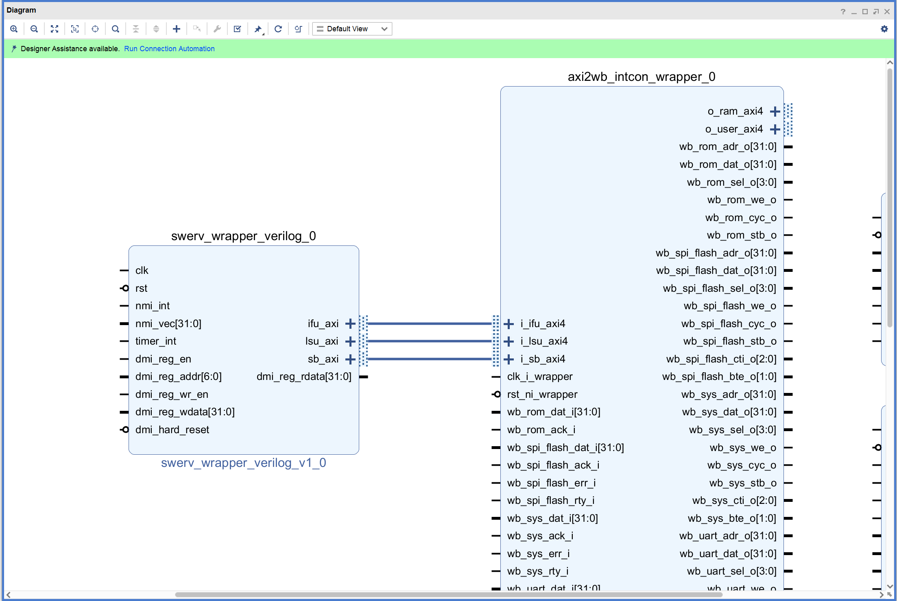
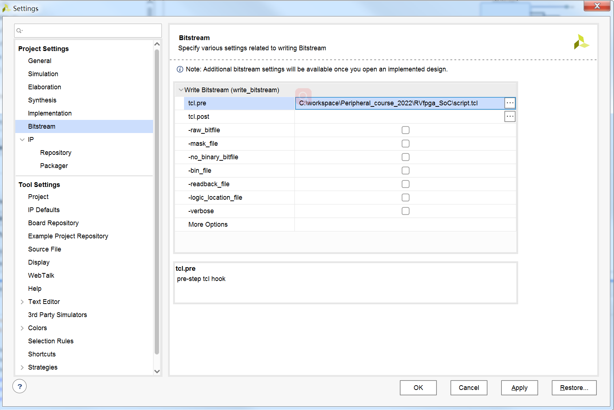

# RVfpgaSoC入门

## 1. 简介

在本实验中，我们将介绍如何通过IP集成的方式来构建RISC-V片上系统（SoC）。SoC可将整个电子或计算机系统集成到其中。
SoC包括一个内核以及加载操作系统和运行程序所需的所有外设和接口。

SoC的设计过程从FPGA的原型设计开始。我们的重点是使SoC以FPGA为目标。

我们将使用的RISC-V CPU是Western Digital的SweRV EH1内核，而将在本实验中设计的SoC是SweRVolfX的子集，
我们将使其以Nexys4 DDR 开发板为目标。

在开始本实验之前，强烈建议先阅读RVfpga课程入门指南以了解整个RVfpga系统。以下是RVfpga课程中引入的RVfpga系统的简要说明。

RVfpga系统中使用的片上系统（SoC）称为SweRVolfX（如下图所示），它基于SweRVolf版本0.7.3（https://github.com/chipsalliance/Cores-SweRVolf/releases/tag/v0.7.3），而后者基于SweRV EH1内核组合构建。

除SweRV EH1内核组合外，SweRVolf SoC还包括引导ROM、UART、系统控制器和SPI控制器。SweRV EH1内核使用AXI总线，外设使用
Wishbone总线；SoC还具有AXI-Wishbone桥。

在RVfpga系统中，SweRVolf SoC扩展了一些功能，例如另一个SPI控制器（SPI2）、GPIO（通用输入/输出）控制器和PTC（PWM/定时器/计数器）模块。
（在上图中，这些新外设以红色显示）。该片上系统称为SweRVolfX（X代表扩展）。

下表列出了通过Wishbone互连连接到SweRV EH1内核的外设的存储器映射地址。

在RVfpga中，介绍SweRVolfX时没有提供关于如何创建SweRVolfX的任何细节。RVfpgaSoC将介绍如何使用SweRV内核、存储器和外设等构件从头开始构建SweRVolfX SoC的
子集。

本实验将逐步介绍如何从CPU（SweRV EH1内核组合）开始，然后如何将其构建到SoC中。
我们将使用Vivado块设计工具。Vivado的块设计工具以图形方式简化了组件布线，使流程更易于理解和可视化。
这种可视化方法还会说明每个模块如何与其他模块连接以形成SoC。这些模块可以分为三大块或三大类：

- CPU（SweRV EH1内核组合）
- 互连（AXI互连、AXI2WB和WB互连）
- 外设（引导ROM、GPIO控制器和系统控制器）

SweRVolfX有许多不同的模块，但有些并不是准系统RISC-V SoC所必需的。

## 2. 实验步骤
### 2.1 打开Vivado
运行Vivado（在Linux中，打开终端并输入：vivado；在Windows中，从“Start”（开始）菜单或双击Vivado图标打开Vivado）。
Vivado欢迎屏幕随即打开。单击“Create Project”（创建项目），如下图所示。

### 2.2 新建RTL项目
“Create a New Vivado Project”（新建Vivado项目）向导随即打开（如下图所示）。单击“Next”（下一步）。

输入项目名称，选择项目位置路径，如下图所示。然后单击“Next”（下一步）。

选择“RTL Project”（RTL项目）作为项目类型，同时勾选先不添加设计资源，然后单击“Next”（下一步）（如下图所示）。

### 2.3 选择Nexys4 DDR作为目标开发板
在“Default Part”（默认部件）窗口中，单击“Boards”（电路板），然后选择Nexys4 DDR（如下图所示）。单击“Next”（下一步）。

在“New Project Summary”（新建项目摘要）窗口中，单击“Finish”（完成）。

### 2.4 添加IP仓库到工程
在“Project Manager”（项目管理）中选择“Settings”，弹出“Settings”（设置）界面，选择“IP->Repository”，如下图所示。

点击“+”（添加），找到 ip_repo 目录，如下图所示。

如下图所示，然后点击 2 次 OK 完成IP仓库的添加。

### 2.5 添加RTL源文件和约束文件
在“Project Manager”（项目管理）中选择“Add Sources”（添加源文件），在“Add Sources”（添加源文件）窗口中，单击“Add Directories”（添加目录），如下图所示。

如下图所示，选择“rtl_src”目录。

单击“Select”（选择），然后单击“Add Files”（添加文件）按钮，选择“All Files”（所有文件）作为文件类型。
导航到我们刚刚添加的rtl_src目录下的LiteDRAM目录，将两个“.init”文件选中，再导航到rtl_src目录下BootROM目录，
在该目录下的sw目录将“boot_main.mem”文件选中，的然后单击“OK”（确定）。

设计文件添加完成后如下图所示，单击“Finish”（完成）。

现在将为系统添加约束文件。在“Add Constraints”（添加约束）窗口中，单击“Add Files”（添加文件），选择约束文件，
如下图所示，单击“Finish”（完成）。

### 2.6 创建块设计（Block Design）
使用Vivado的块设计功能（Block Design）来添加创建SweRVolfX子集所需的模块，然后将模块彼此连接。

单击“IP Integrator”（IP集成器）标题下的“Create block design”（创建块设计），在“Flow Navigator”（流程导航器）中创建一个新的块设计，选择“swerv_soc”作为“Design name”（设计名称），如下图所示。

将弹出一个空白的块设计图面板，如下图所示。

右键单击空白块设计并选择“Add IP”（添加IP）选项，将ip_repo中的三个IP模块添加到块设计，添加完成后如下图所示。

右键单击空白块设计并选择“Add Module”（添加模块）选项，在弹出的对话框中找到“bootrom_wrapper”，如下图所示，点击“OK”完成添加。

同样的方法再添加“syscon_wrapper”模块。完成后的块设计如下图所示。

将“swerv_wrapper_verilog_0”与“axi2wb_intcon_wrapper_0”连接，如下图所示。

将外设与“axi2wb_intcon_wrapper_0”连接。先从“bootrom_wrapper_0”模块开始，方法是连接“axi2wb_intcon_wrapper_0”的“wb_rom_xxx_x”线，如下图所示。

将“syscon_wrapper_0”模块与“axi2wb_intcon_wrapper_0”模块连接，如下图所示。

“syscon_wrapper_0”的以下引脚将连接到“swerv_wrapper_verilog_0”，如下图所示。

- o_timer_irq
- o_nmi_vec[31:0]
- o_nmi_int

将“wb_gpio_wrapper_0”模块与“axi2wb_intcon_wrapper_0”模块连接，再将“wb_gpio_wrapper_0”模块的“wb_inta_o”引脚与“syscon_wrapper_0”模块的“gpio_irq”引脚连接。如下图所示。

“swerv_wrapper_verilog_0”的其它引脚设置为外部引脚（鼠标右键，选择“Make External”）。

将“clk_0”和“rst_0”外部引脚连接到其余模块，包括axi2wb_intcon_wrapper_0、syscon_wrapper_0、bootrom_wrapper_0和wb_gpio_wrapper_0。

将axi2wb_intcon_wrapper_0模块的“o_ram_axi4”引脚设置为外部引脚，并更名为“ram”；再将syscon_wrapper_0模块的“AN”和“Digits_Bits”引脚、“i_ram_init_done”和“i_ram_init_error”、以及wb_gpio_wrapper_0模块的“bidir”引脚（设置后更名为“bidir”）也都设置为外部引脚，如下图所示。

块设计完成后如下图所示。

点击转换到“Address Editor”窗口，按照下图所示进行地址分配。

按下“Ctrl + S”保存块设计。

### 2.7 生成块设计模块Verilog文件
导航到源文件面板，找到刚刚创建的块设计模块“swerv_soc”。右键单击该块设计，然后选择“Create HDL Wrapper”（创建HDL包装
程序），如下图所示。

选择“Let Vivado manage wrapper and auto-update”（由Vivado管理包装程序并自动更新）选项，然后单击“OK”（确定）继续操作。

将看到严重警告弹出窗口，因为块设计中有几个引脚未连接，这些引脚将自动连接到“0”（地）。单击“OK”（确定）。

### 2.8 生成比特流
导航到“Settings”（设置），转到“Bitstream”（比特流）选项卡，然后单击“tcl.pre”按钮。

选择“New script”（新建脚本）选项，导航到相应的路径并选择“script.tcl”文件，单击“OK”（确定）并应用更改。

单击“Flow → Generate Bitstream”（流程 → 生成比特流）。
