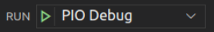

# 在RVfpgaSoC上运行软件

## 1. 简介
本实验介绍如何在实验1中创建的SweRVolfX子集（使用Vivado块设计工具创建）上运行用C语言或汇编语言编写的程序。

实验将介绍如何使用PlatformIO将RVfpga（由实验1中创建的比特流所定义）下载到Nexys4 DDR开发板上，然后介绍如何使用PlatformIO调试示例程序。

## 2. 实验步骤
将Nexys4 DDR开发板连接到计算机，使用左上角的开关开启Nexys4 DDR开发板（如下图所示）。

打开VSCode和PlatformIO（如果尚未打开）。

在顶部菜单栏上，单击“File → Open Folder”（文件 → 打开文件夹），如下图所示。

浏览至程序所在目录（这里为C:\workspace\Peripheral_course_2022\example_Blinky_S），选择目录example_Blinky_S（不要打开，只需选中），然后单击窗口顶部的“OK”（确定）。PlatformIO现在将打开示例。

单击左侧边栏中的platformio.ini，打开文件platformio.ini（如下图所示）。通过编辑以下行，建立到系统中的RVfpga比特流的路径，如下图所示。

单击左侧菜单功能区中的PlatformIO图标 

展开“PROJECT TASKS → env:swervolf_nexys → Platform”（项目任务 → env:swervolf_nexys → 平台），然后单击“Upload Bitstream”（上传比特流），如图下图所示。

注：如果“PROJECT TASKS”（项目任务）窗口为空，则必须先通过单击刷新“PROJECT TASKS”（项目任务）。这可能需要几分钟。

现在比特流已上传完毕，我们将开始调试过程（工程中目前只有一个汇编代码程序，如下图所示）。

单击  运行和调试程序；然后通过单击播放按钮  开始调试。PlatformIO在main函数的开头设置了一个临时断点。因此，单击“Continue”（继续）按钮  运行程序。

将看到板上最右侧的LED开始闪烁，如下图所示。

通过单击暂停按钮  暂停执行。执行将在无限循环内的某处停止（可能在time1延时循环内）。

通过单击第18行左侧创建一个断点。随后将出现一个红点，断点将添加到“BREAKPOINTS”（断点）选项卡（如下图所示）。

然后，通过单击继续按钮  继续执行。随后将一直执行到存储字（sw）指令后停止，该指令会将1（或0）写入最右侧的LED。

继续执行几次；将看到驱动到最右侧LED的值每次都会发生变化。

停止调试 ，然后通过单击  返回到资源管理器窗口。通过选择“File → Close Folder”（文件 → 关闭文件夹）关闭程序。
