# GPIO 实验

## 1. 概述
在本实验中，我们在Vivado中通过IP集成的方法，搭建了一个简单的RVfpga处理器系统；该系统主要包括：RVfpga处理器IP、内存、GPIO等外设模块；
利用PlatformIO我们可以编写C语言程序对RVfpga处理器系统的外设进行操作演示。

## 2. 在RVfpga中添加基于AXI4接口的GPIO模块
启动Vivado，打开实验 1 的工程，如下图所示。

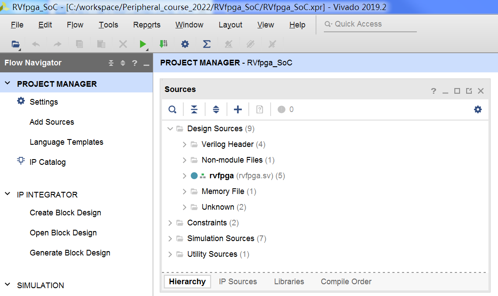

点击“Open Block Design”打开块设计，如下图所示。

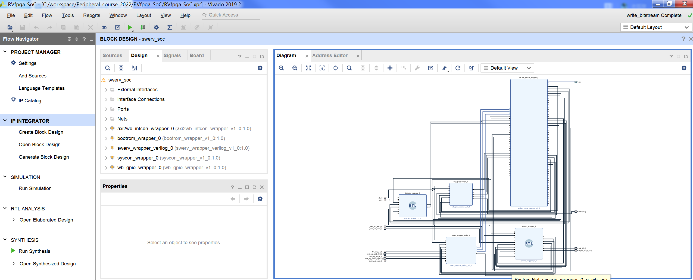

添加AXI Interconnect和AXI GPIO二个IP模块，如下图所示。

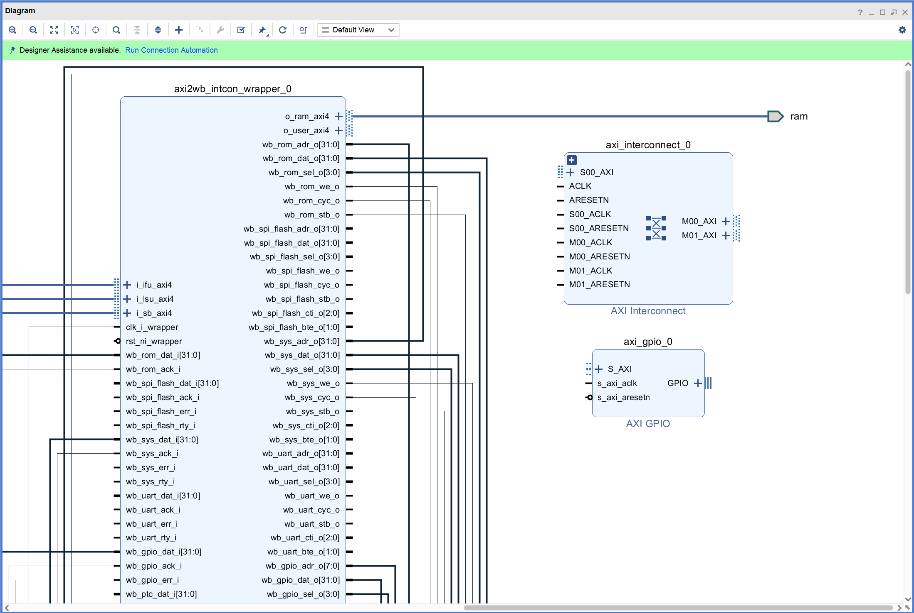

双击axi_interconnect_0模块，将“Number of Master Interfaces”的数量从2减少为1，如下图所示。

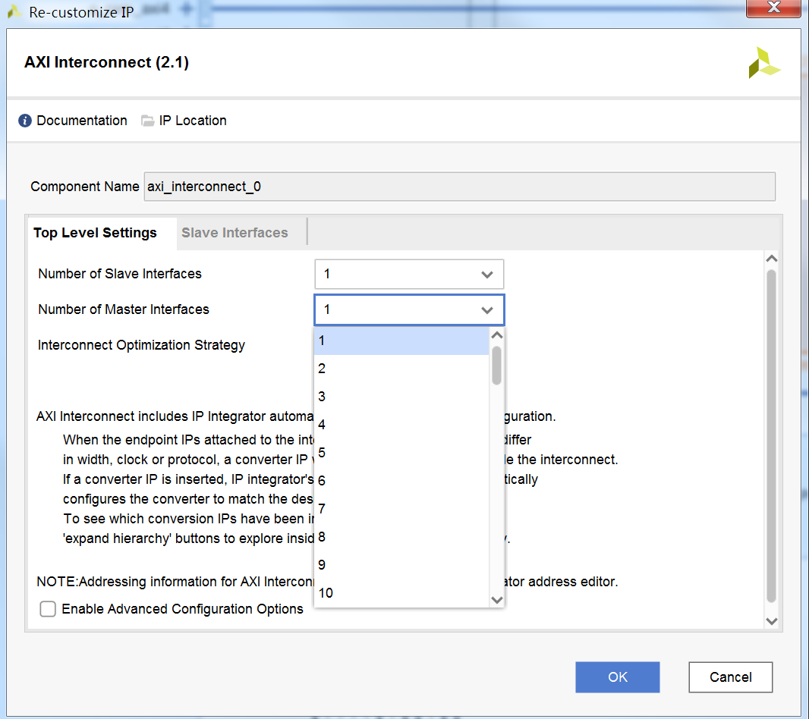

将新添加的IP模块连接到原来的块设计中，如下图所示。

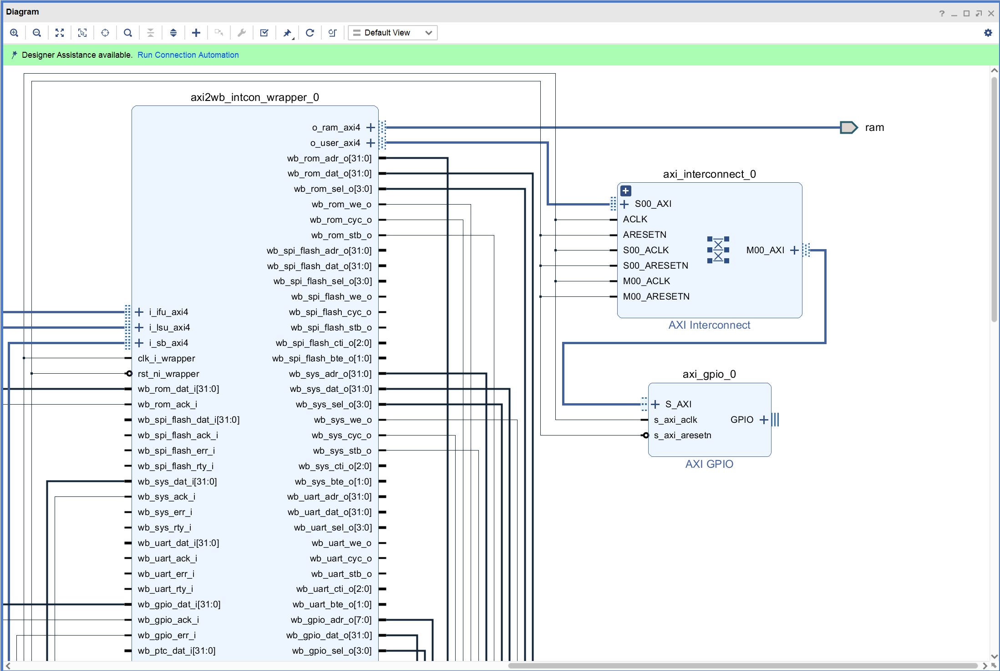

双击axi_gpio_0模块，勾选“All Outputs”，然后将“GPIO Width”的数量从32修改为16；同时勾选“Enable Dual Channel”，此时GPIO 2的选项由灰变亮，之后勾选GPIO 2中的“All Inputs”，然后将“GPIO Width”的数据从32修改为16；完成设置后如下图所示。

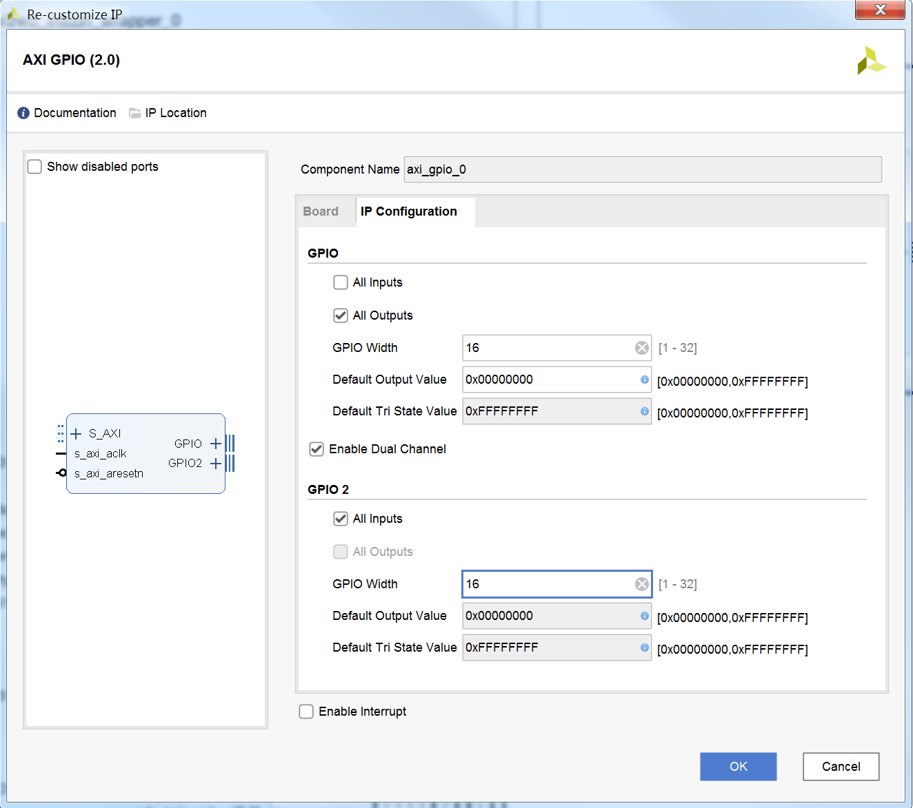

将axi_gpio_0模块的GPIO和GPIO2端口展开，将相应的引脚设为外部引脚，然后将输出引脚更名为“o_led”，输入引脚更名为“i_sw"，如下图所示。

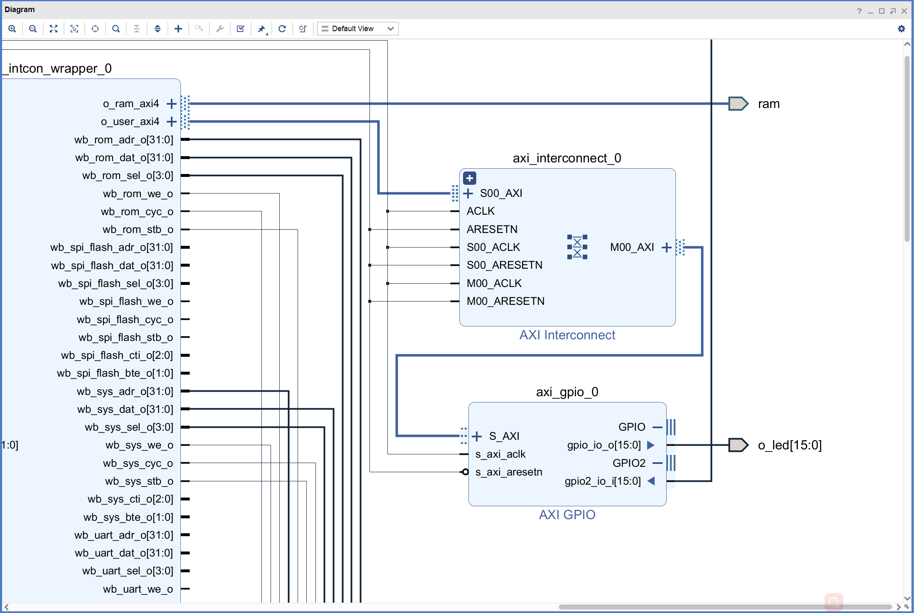

打开“Address Editor”，为axi_gpio_0模块分配起始地址“0x80100000”，如下图所示。

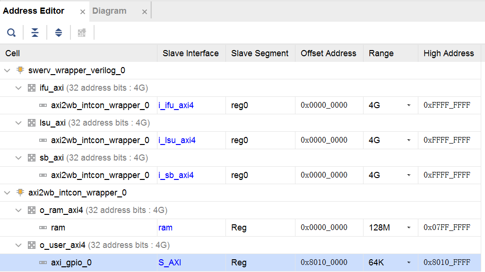

点击Validate Design，对设计的正确性进行校验。校验过程中如果出现警告，点击OK忽略。

点击Generate Block Design，弹出对话框后选择Generate更新swerv_soc_wrapper文件。

根据更新后的swerv_soc_wrapper对rvfpga.sv文件进行修改，如下图所示，增加“o_led”和“i_sw”的连接，同时注释270、271和273这三行代码。

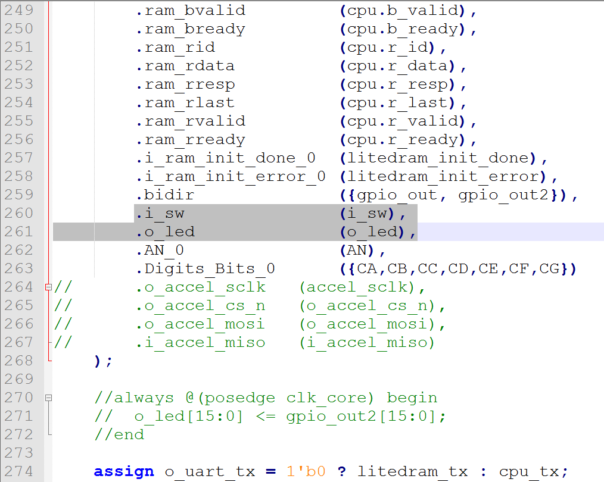

最后，点击Generate Bitstream按键，生成bitstream文件。

## 3. 应用程序编译、调试和执行
### 3.1 创建RVfpga工程
打开VSCode，如果PlatformIO没有启动，点击左侧PlatformIO图标，然后点击“Open”打开PIO Home，如下图所示。

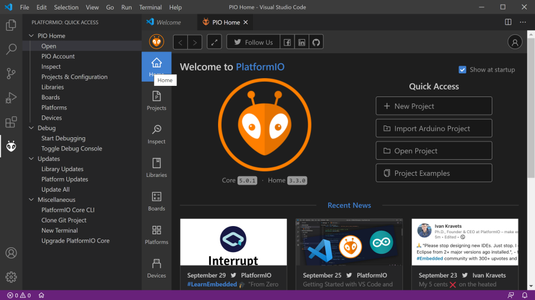

如上图所示，选择新建一个工程。如下图所示进行新建工程的设置，完成后点击“Finish”。

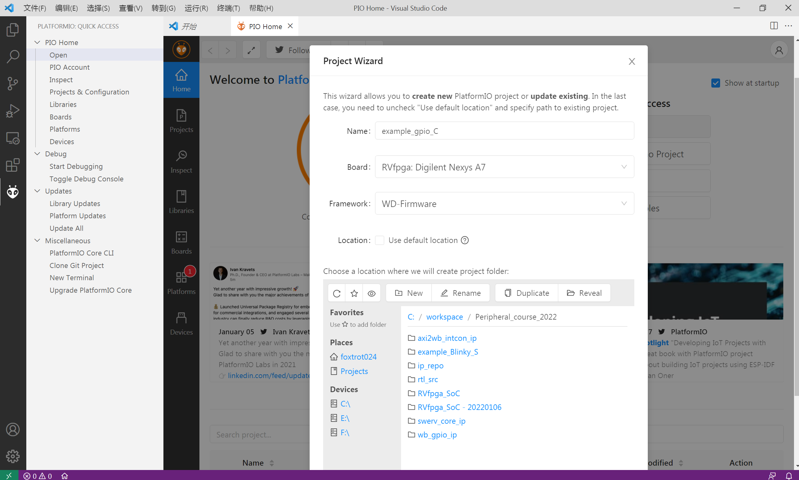

在platformio.ini文件（如下图所示）中添加比特流（bitstream）文件的路径。

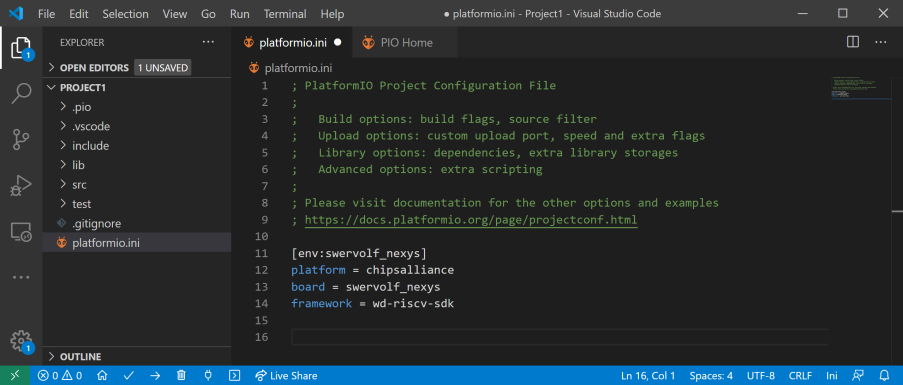

platformio.ini文件修改完成后如下图所示。

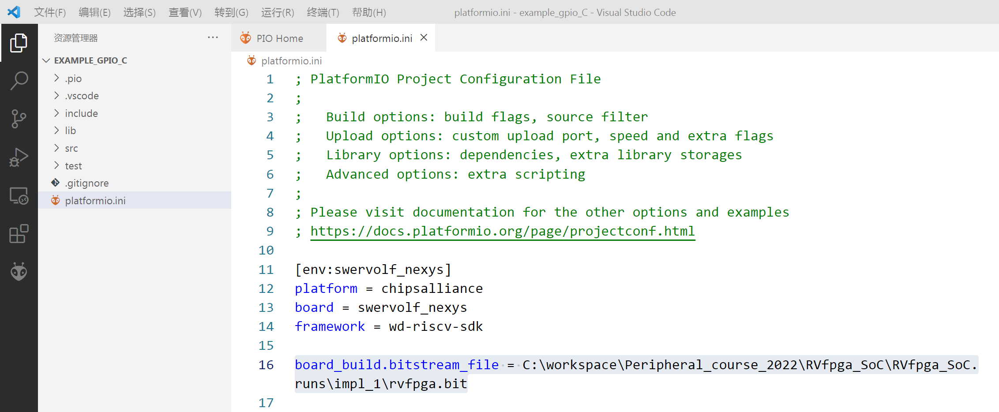

### 3.2 编辑C程序
如下图所示，点击“File → New File”。

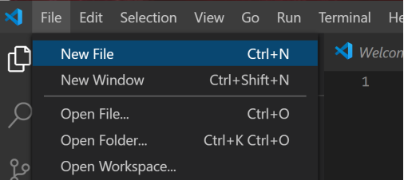

完成程序编辑后（代码如下所示），按“CTRL-S”将程序保存到工程src目录下，并且命名为gpio_demo.c。

```
#define IO_LEDR     0x80100000

#define READ_GPIO(dir) (*(volatile unsigned *)dir)
#define WRITE_GPIO(dir, value) { (*(volatile unsigned *)dir) = (value); }

int main ( void )
{
    int i, j=1, count=0xF, delay=10000000;

    while (1) { 
        WRITE_GPIO(IO_LEDR, count);

        if(j == 1) {
		    count = count << 1;
		    if(count == 0xf000)
		        j = 0;
		} else {
				count = count >> 1;
		    if(count == 0x000f)
		        j = 1;
		}

		for (i=0; i<delay; i++);
    }

    return(0);
}

```

### 3.3 运行调试程序
连接Nexys4 DDR开发板，按实验2的步骤对程序进行调试和运行，同时观察程序的运行情况。

### 4 动手实践

对gpio_demo.c程序进行修改，要求通过开关的不同输入控制LED灯的显示。


