# UART 串行接口实验

## 1. 概述
在本实验中，我们将学习如何设计和使用UART串行接口。

## 2. 在RVfpgaSoC系统中添加UART硬件模块
启动Vivado，打开实验2的工程，如下图所示。

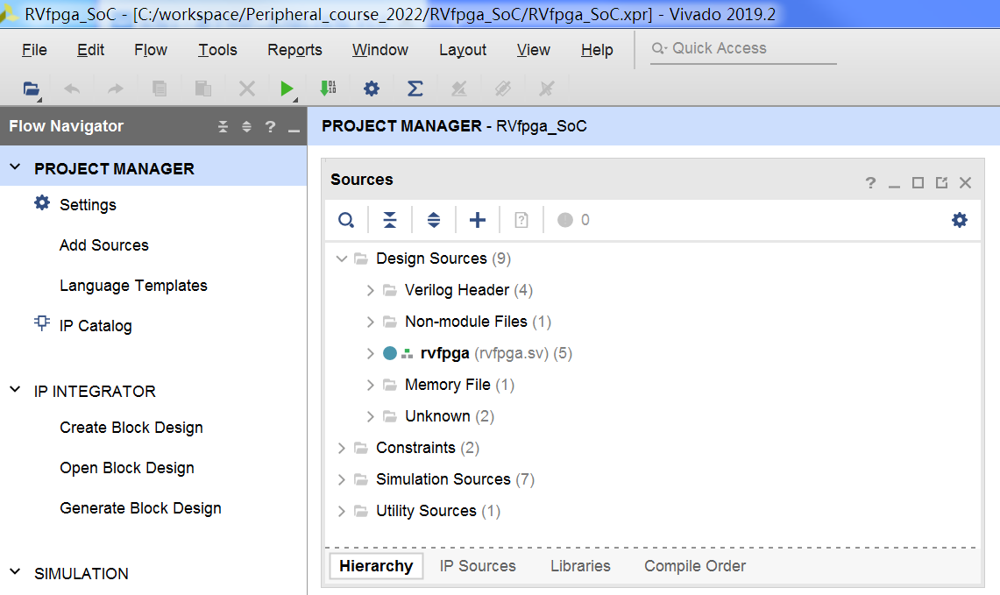

在“Project Manager”（项目管理）中选择“Add Sources”（添加源文件），在“Add Sources”（添加源文件）窗口中，单击“Add Directories”（添加目录），将uart目录添加到工程，如下图所示。

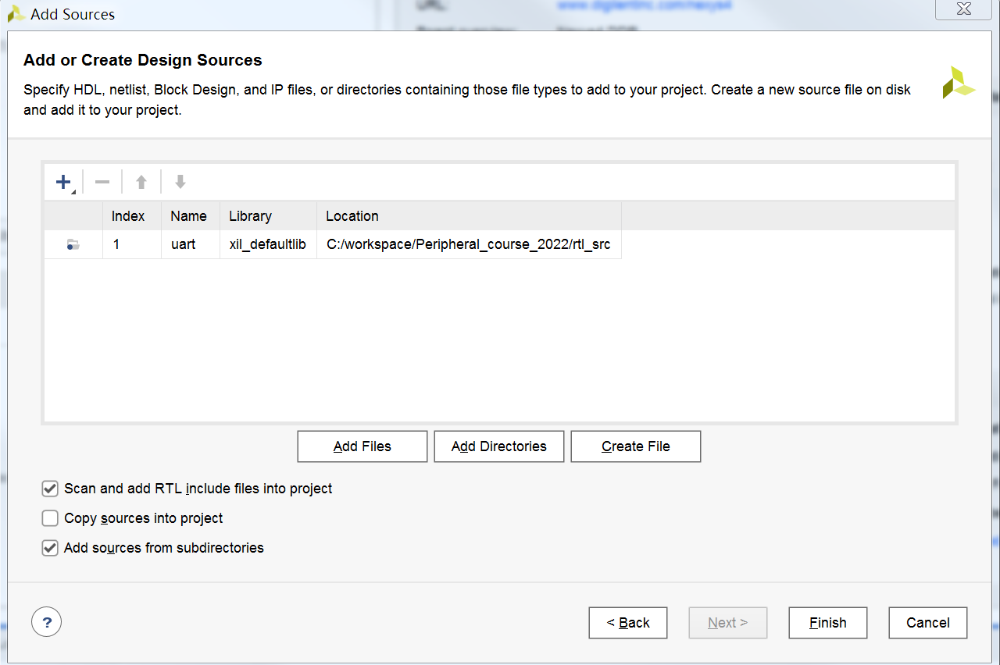

点击“Open Block Design”打开块设计，如下图所示，通过“Add Module”将wb_uart_wrapper模块添加到块设计。

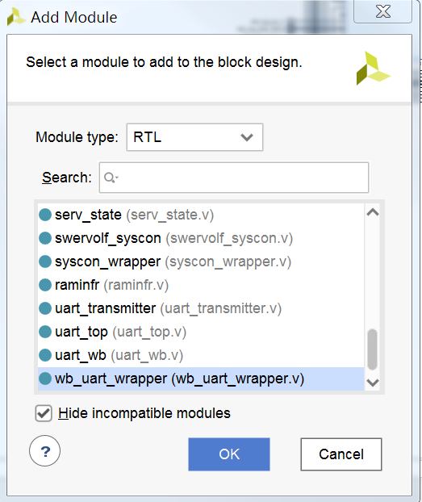

将刚刚添加的wb_uart_wrapper_0模块连接到块设计，连接完成后如下图所示。

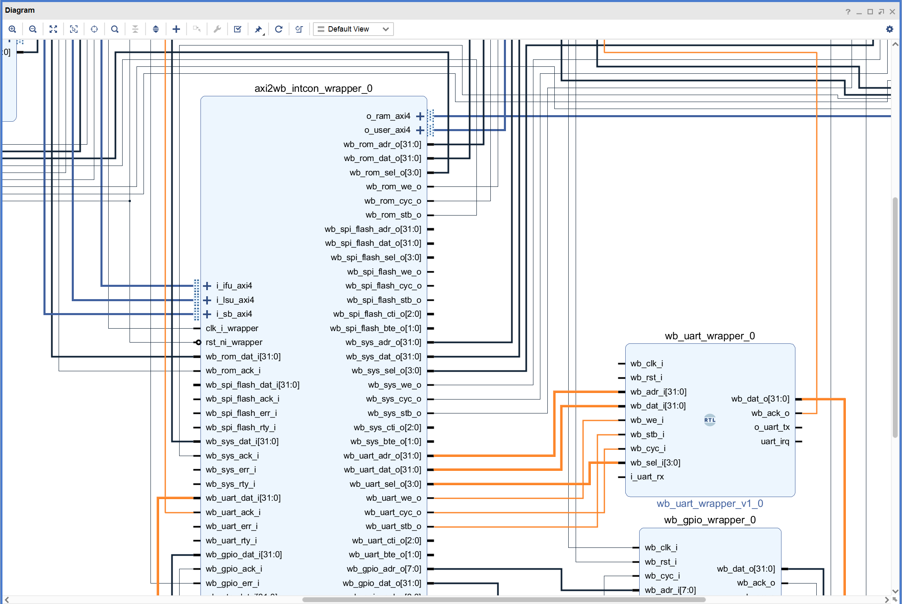

然后，连接wb_uart_wrapper_0模块的时钟和复位引脚。

最后，将uart_top_0模块的i_uart_rx和o_uart_tx引脚设置为外部引脚。

点击Validate Design，对设计的正确性进行校验。校验过程中如果出现警告，点击OK忽略。

点击Generate Block Design，弹出对话框后选择Generate更新swerv_soc_wrapper文件。

根据更新后的swerv_soc_wrapper对rvfpga.sv文件进行修改，如下图所示，将216和217行的注释取消。

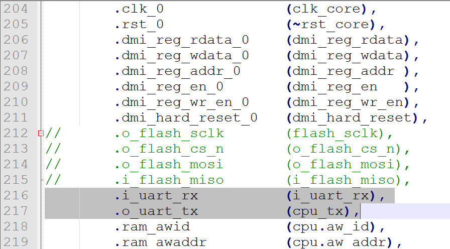

最后，点击Generate Bitstream按键，生成bitstream文件。

## 3. 应用程序编译、调试和执行
### 3.1 创建RVfpga工程
打开VSCode，如果PlatformIO没有启动，点击左侧PlatformIO图标，然后点击“Open”打开PIO Home，按照实验3的步骤创建工程，如下图所示。

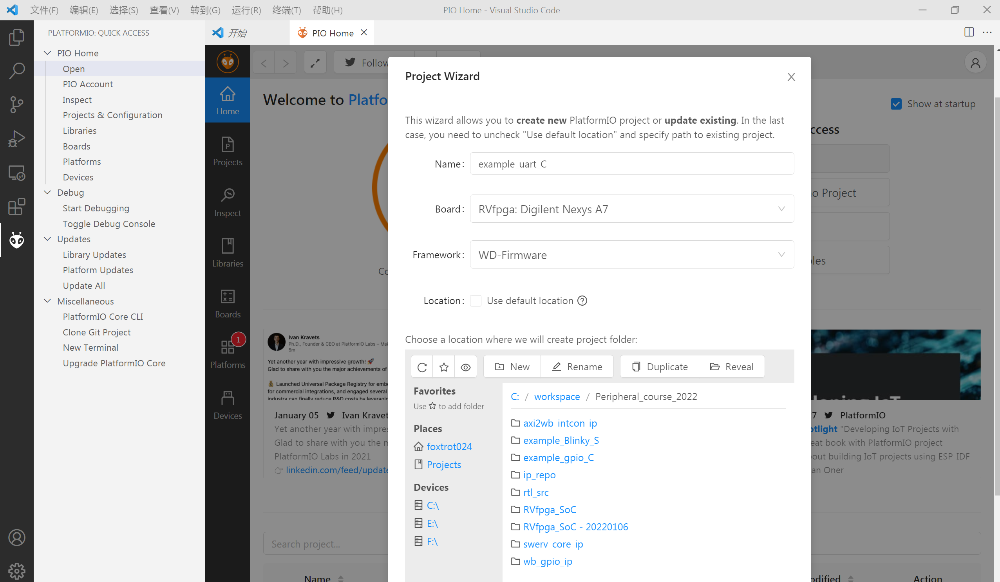

在platformio.ini文件中添加比特流（bitstream）文件的路径，并定义UART串口通信的波特率，修改后的platformio.ini文件如下图所示。

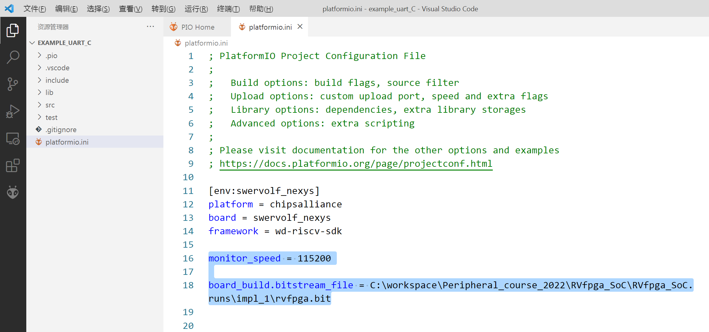

### 3.2 编辑C程序
点击“File → New File”，完成程序编辑后（代码如下所示），按“CTRL-S”将程序保存到工程src目录下，并且命名为uart_demo.c。

```
#if defined(D_NEXYS_A7)
   #include <bsp_printf.h>
   #include <bsp_mem_map.h>
   #include <bsp_version.h>
#else
   PRE_COMPILED_MSG("no platform was defined")
#endif
#include <psp_api.h>

int main(void)
{
   int i;

   /* Initialize Uart */
   uartInit();

   while(1){
      /* Print "hello world" message on the serial output (be carrefoul not all the printf formats are supported) */
      printfNexys("hello world\n");
      /* Delay */
      for (i=0;i<10000000;i++){};
   }

}
```

### 3.3 运行调试程序
连接Nexys4 DDR开发板，按实验2的步骤对程序进行调试和运行，同时观察程序的运行情况。

程序开始运行后（必须等到程序开始运行后），单击PlatformIO窗口底部的串行监视器按钮 。

 **警告：** 如果在程序开始运行（并到达第一个临时断点）之前打开串行监视器，UART将出现问题，无法正常工作。

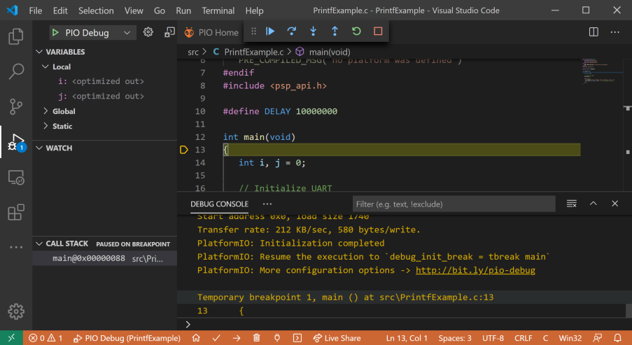

## 4. 动手实践
### 4.1 RVfpga_SoC硬件修改
将上面的RVfpga_SoC工程复制，并重命名为RVfpga_SoC_uart。启动Vivado，打开刚刚复制的RVfpga_SoC_uart工程，如下图所示。

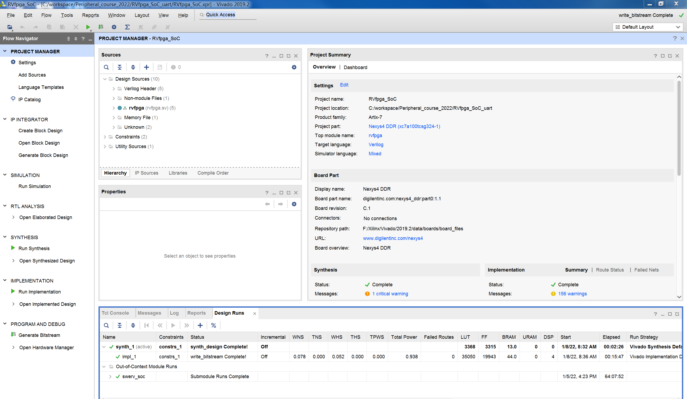

点击“Open Block Design”打开块设计，将前面添加的wb_uart_wrapper_0模块删除。

点击“Add IP”，添加一个AXI UART16550模块，如下图所示。

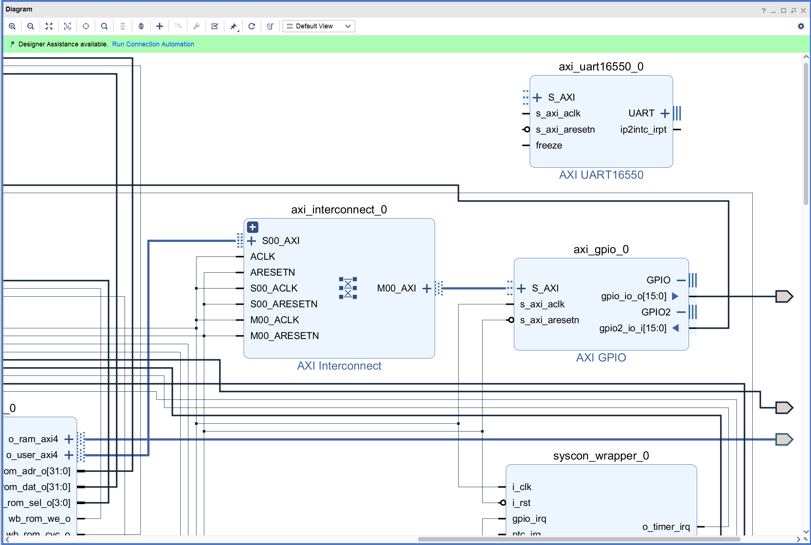

双击axi_interconnect_0模块，在互连模块上增加一个AXI的主端口，如下图所示。

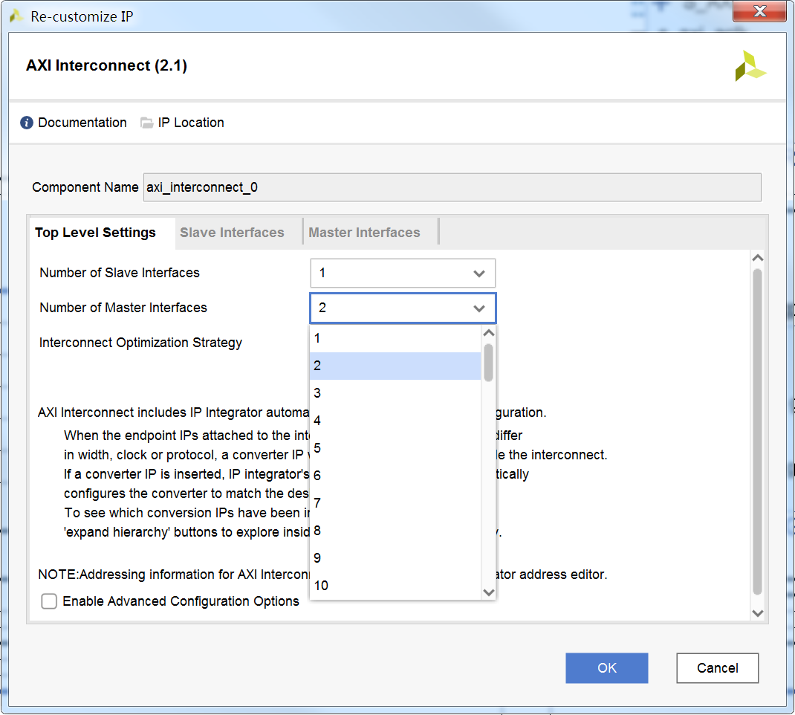

点击“Add IP”，再添加一个constant模块；然后双击该模块，按下图所示进行设置。

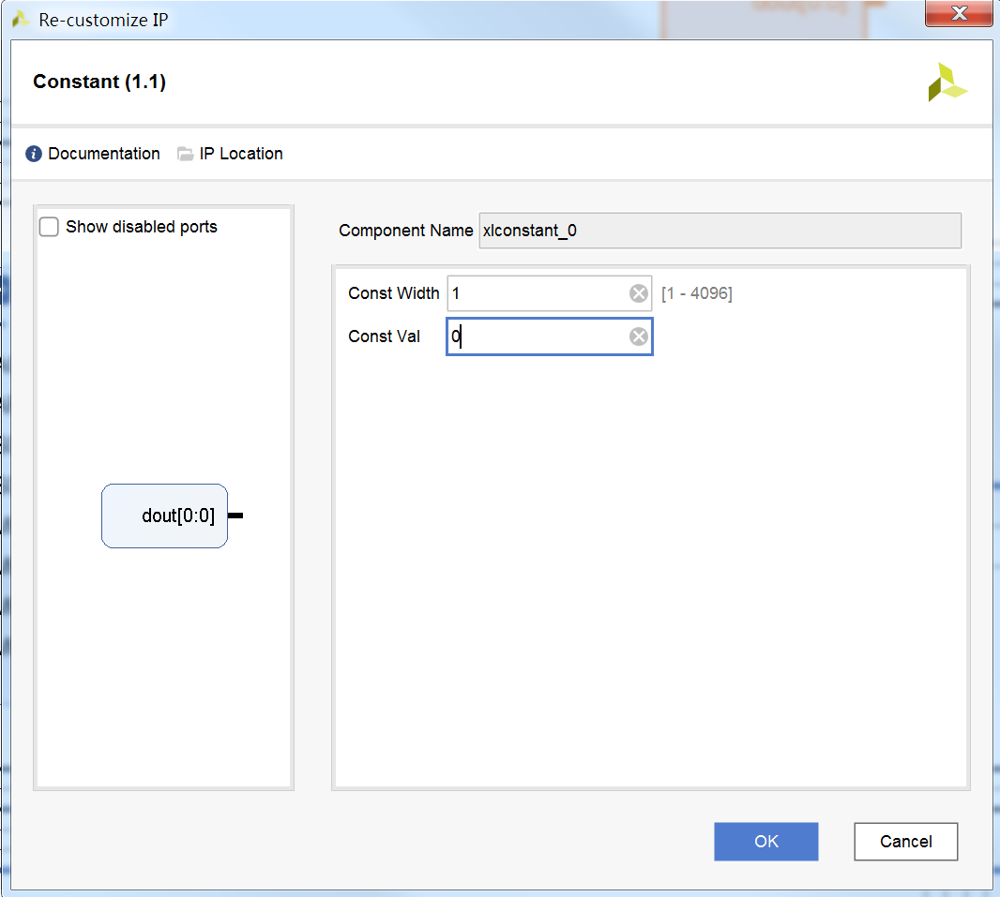

将axi_uart16550_0模块连接到axi_interconnect_0和constant模块，如下图所示。

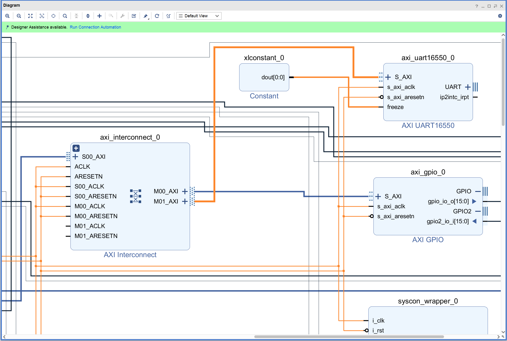

将axi_uart16550_0模块的UART端口展开，然后将UART端口的sout输出引脚连接o_uart_tx外部引脚、sin输入引脚连接i_uart_rx外部引脚，同时连接axi_interconnect_0模块新增端口的时钟和复位引脚的连接，如下图所示。

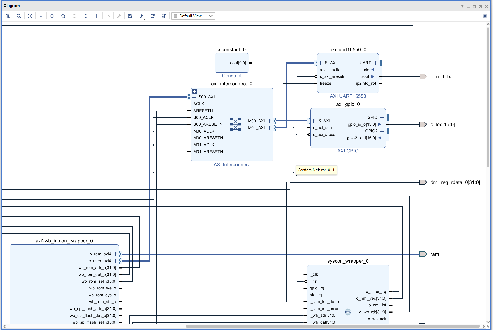

打开“Address Editor”，将axi_uart16550_0模块的地址设置为0x80110000，如下图所示。

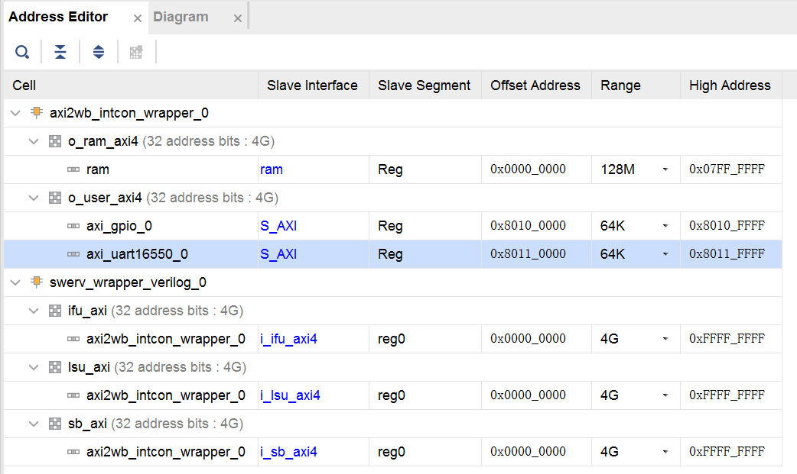

点击Validate Design，对设计的正确性进行校验。校验过程中如果出现警告，点击OK忽略。

点击Generate Bitstream按键，生成bitstream文件。

### 4.2 应用程序编译、调试和执行
创建RVfpga工程，在串口输出“hello world”。
