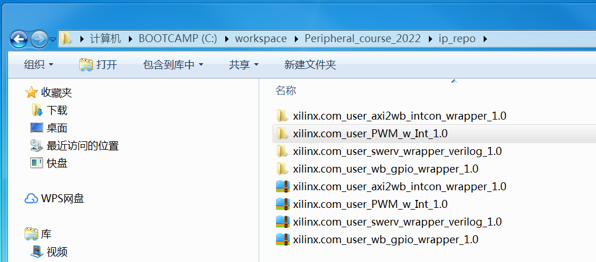
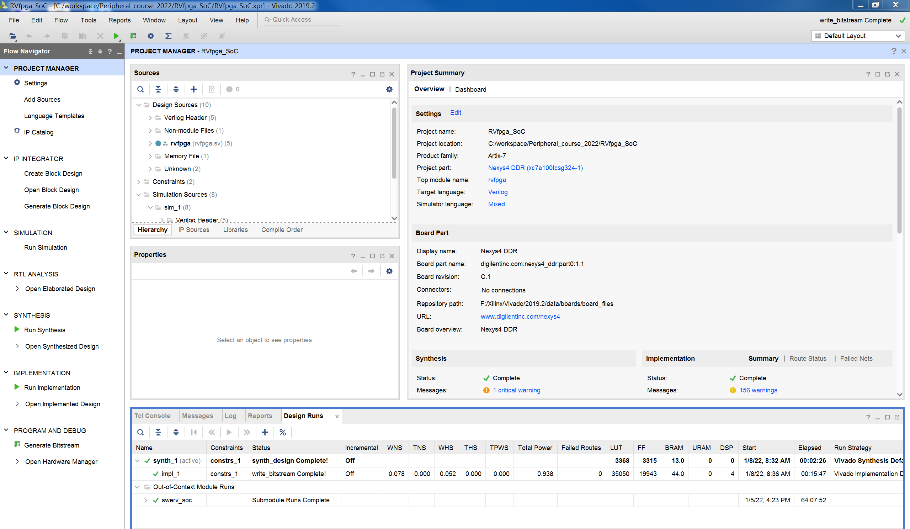
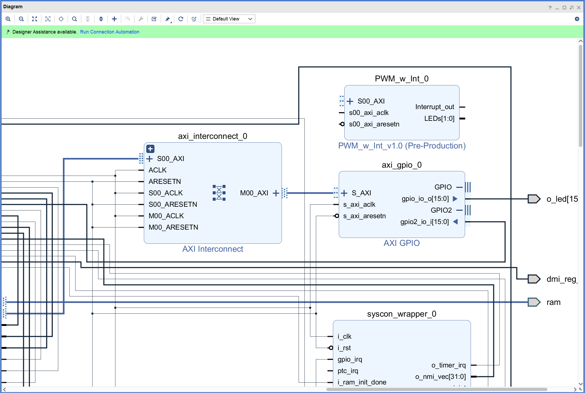
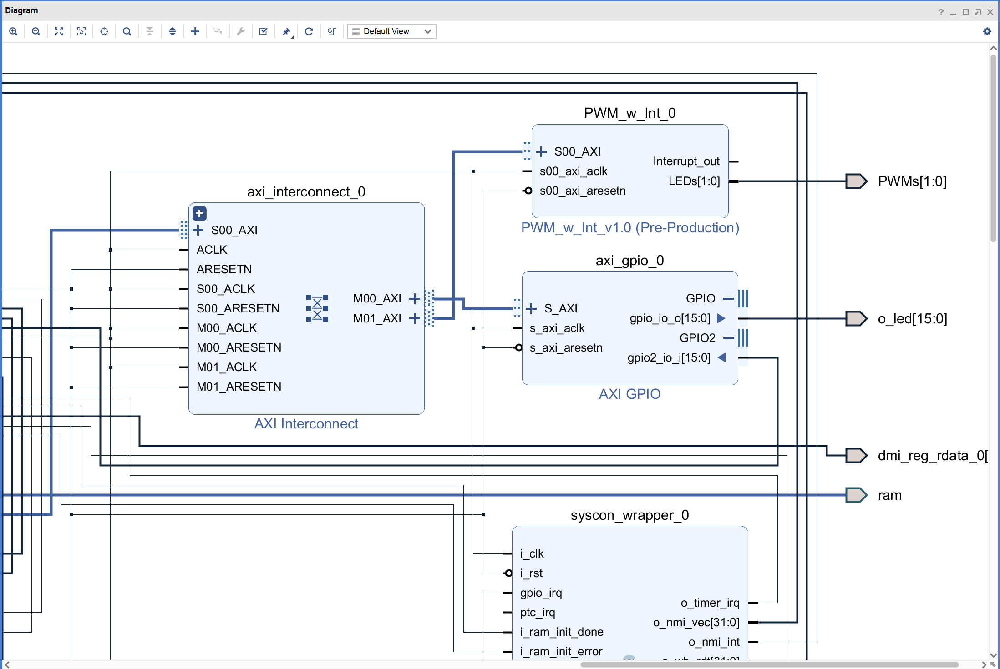
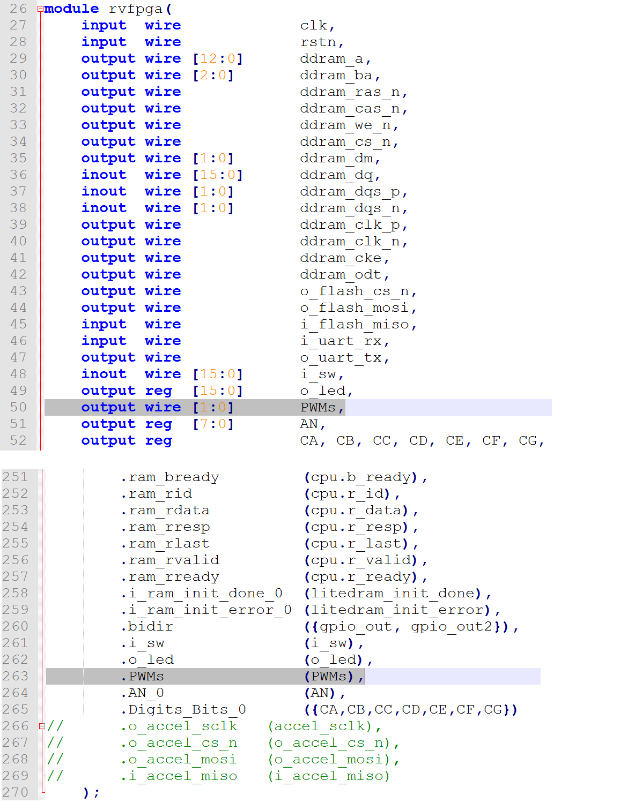
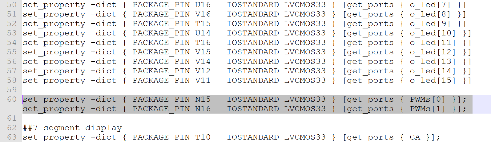

# 基于AXI4的自定制接口实验

## 1. 概述
在本实验中，将自己动手实现一个基于AXI总线接口标准的外设模块；然后，通过Block Design将其添加到RVfpga_SoC。

通过本实验，掌握基于Vivado IP集成开发流程设计实现处理器自定制外设模块IP的方法；最终，为后续设计实现更加复杂的RVfpga_SoC奠定基础。

## 2. 基于AXI4总线接口的自定制外设模块封装

开始实验前需要先新建一个Vivado工程或者有一个现成的Vivado工程，这里假设该Vivado工程名为MIPSfpga_CustomIP。

双击Vivado图标启动Vivado，打开MIPSfpga_CustomIP工程；然后，如下图所示，选择Create and Package IP菜单。

出现Create and Package IP简介对话框后，点击 Next；在弹出的对话框中选择Create a new AXI4 peripheral选项，如下图所示；然后，点击 Next。

如下图所示，在对话框中输入IP模块的名称、版本号等信息；然后，点击 Next。

如下图所示，在新弹出的对话框中，设定该IP模块AXI4接口的类型和参数，这里选择接口类型为AXI4-Lite的从端口，该接口包含4个寄存器，寄存器的位数为32位。

AXI4接口类型和参数设置完成后，点击Next；接下来选择Edit IP选项，如下图所示；然后点击Finish。

这时会启动一个新的Vivado界面，在该界面里Vivado新建了一个名为edit_PWM_w_Int_v1_0的工程，如下图所示。

至此，我们有了一个基于AXI4总线接口的自定制外设模块的IP模板；
接下来就需要对该edit_PWM_w_Int_v1_0工程进行相应的修改和完善，从而设计出我们需要的自定制外设。

我们这个IP要适用于所有FPGA开发板，所以要配置compatibility选项，按下图所示进行配置。

以本实验的PWM外设模块的设计为例，需要进行以下修改（详细情况请参看程序代码），具体步骤如下：

在edit_PWM_w_Int_v1_0工程中打开名为PWM_w_Int_v1_0.v的文件，找到注释行 “//Users to add parameters here”，在该行后面添加整型参数 PWM_PERIOD = 20；
然后，在注释行 “//Users to add ports here” 后面添加线网型输出口Interrupt_out、LEDs、PWM_Counter和DutyCycle，如下图所示。

在PWM_w_Int_v1_0.v 文件中找到名为PWM_w_Int_v1_0_S00_AXI_inst的实例化模块，在其中添加端口引用，即.slv_reg0（DutyCycle），如下图所示。

最后，在注释行 “//Add user logic here” 后添加名为PWM_Controller_Int的模块实例化，如下图所示。

PWM_w_Int_v1_0.v文件编辑完成后，再打开其下层的名为PWM_w_Int_v1_0_S00_AXI.v 的文件，
在注释行 “//Users to add parameters here” 后将slv_reg0修改为输出端口，如下图所示。

然后，如下图的所示，在工程中通过 “Add Source” 菜单添加一个名为PWM_Controller_Int.v的设计文件。

添加完设计文件后，在工程中打开PWM_Controller_Int.v文件，根据需要输入程序源码；
然后，编写相应的仿真测试程序对外设模块设计的正确性进行功能仿真验证，
仿真正确后可以综合，综合（Synthesis）和仿真（Simulation）都无误后就可以对该模块进行 IP 封装。

IP封装通过Vivado的Package IP功能来实现；如果Package IP的界面没有在工程中显示，则可以通过选择 “Package IP” 菜单打开该界面。

如下图所示，在Package IP界面中，找到 “File Groups” 选项；如果 “File Groups” 选项上不是绿色的钩，
则选择 “Merge changes from File Groups Wizard”，然后确认PWM_Controller_Int.v文件是否已经加入到 File Groups 中；
如果选择 “Merge changes from File Groups Wizard”后PWM_Controller_Int.v文件没有自动加入，则需手工添加。

PWM_Controller_Int.v文件成功添加后，正确的结果如下图所示（如果添加的PWM_Controller_Int.v文件不是图中所示的相对路径，
而是绝对路径，则需要手工删除该文件后再重新添加）。

在Package IP界面中选择 “Ports and Interfaces” 选项，检查确认模块的Interrupt_out和LEDs信号是否已经设置为输出引脚；
如果发现 “Ports and Interfaces” 选项上不是绿色的钩，则在该页上点击自动加入；也可以通过右击鼠标，
选择 “Import IP Ports”，找到模块的顶层文件，即PWM_w_Int_v1_0.v，通过手工加入（如下图所示）；

引脚正确添加后的结果如下图所示。

最后，选择 “Click Review and Package” 选项，确认正确无误后点击 “Re-Package IP”，
之后等待Vivado完成 edit_PWM_w_Int_v1_0 工程IP的封装（IP封装完成后，通常该Vivado工程会自动关闭并退出），如下图所示。

IP封装完成后，需要回到MIPSfpga_CustomIP工程，选择 “IP Catalog” 菜单打开IP库，查看刚才封装的PWM外设IP是否在IP库中；
如下图所示，此时IP Catalog中 /User Repository/AXIPeripheral 目录下名为PWM_w_Int_v1.0的IP就是我们刚刚自定制的基于AXI4接口规范的外设模块。

如果需要可以再次打开edit_PWM_w_Int_v1_0工程，对IP进行修改和重新封装。

## 3. RVfpga_SoC使用自定制IP
### 3.1 RVfpga_SoC硬件修改
首先将MIPSfpga_CustomIP目录下的xilinx.com_user_PWM_w_Int_1.0.zip文件复制到RVfpga_SoC所使用的ip_repo目录下，并解压，解压后如下图所示。

启动Vivado，打开实验4的RVfpga_SoC工程（注：不是实验4动手实验的工程！）， 如下图所示。

点击“Open Block Design”打开块设计，通过“Add IP”将PWM模块添加到块设计，如下图所示。

注：如果在IP Catalog中没有找到PWM，则可以在“Settings”中将ip_repo删除，重新同添加一次解决。

参照实验4动手实验连接UART模块的方法，将PWM模块连接到块设计；然后，将PWM模块的LEDs引脚设置为外部引脚，并更名为“PWMs”；完成后的块设计如下图所示。

打开“Address Editor”，将axi_uart16550_0模块的地址设置为0x80120000，如下图所示。

点击Validate Design，对设计的正确性进行校验。校验过程中如果出现警告，点击OK忽略。

点击Generate Block Design，弹出对话框后选择Generate更新swerv_soc_wrapper文件。

根据更新后的swerv_soc_wrapper对rvfpga.sv文件进行修改，如下图所示，将新增加的“PWMs”引脚连接到顶层设计（rvfpga）的端口。

修改rvfpga.xdc文件，增加“PWMs”引脚的约束信息，如下图所示。

点击Generate Bitstream按键，生成bitstream文件。

### 3.2 应用程序编译、调试和执行
参照实验4，创建RVfpga工程，编写PWM的演示程序，并对程序进行运行和调试。

## 4. 动手实验
参照syscon_wrapper_0中封装的数码管显示硬件设计，自己封装一个用于数码管显示的IP模块；并将该模块添加到RVfpga_SoC工程，将RVfpga_SoC工程中原来由syscon_wrapper_0模块输出的“AN_0”和“Digits_Bits_0”引脚转接到自己封装的数码管显示的IP模块上，生成相应的比特流文件。

新建一个RVfpga工程，编写一个可以用于数码管显示接口模块控制的演示程序。

