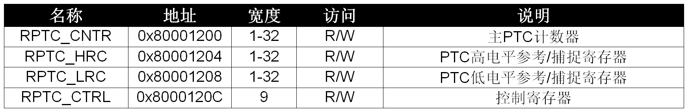
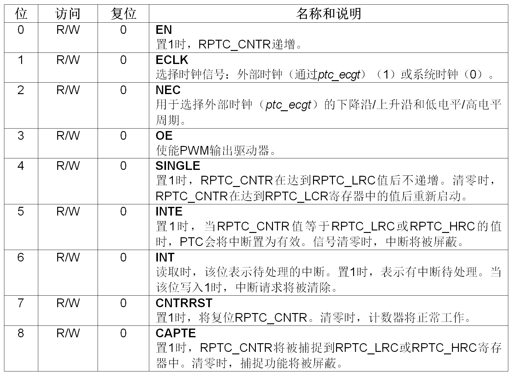
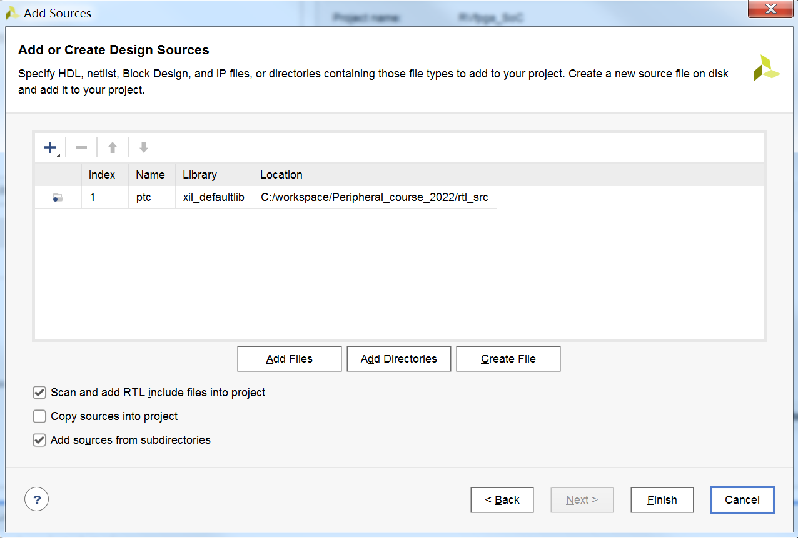
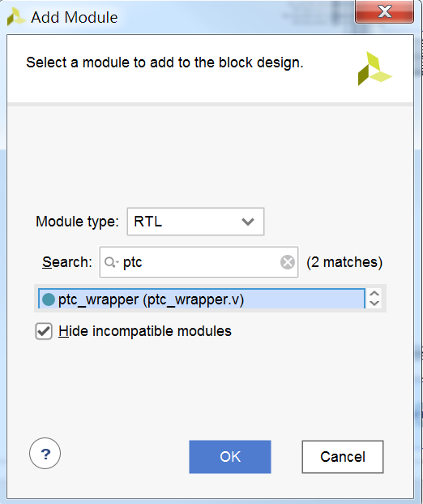
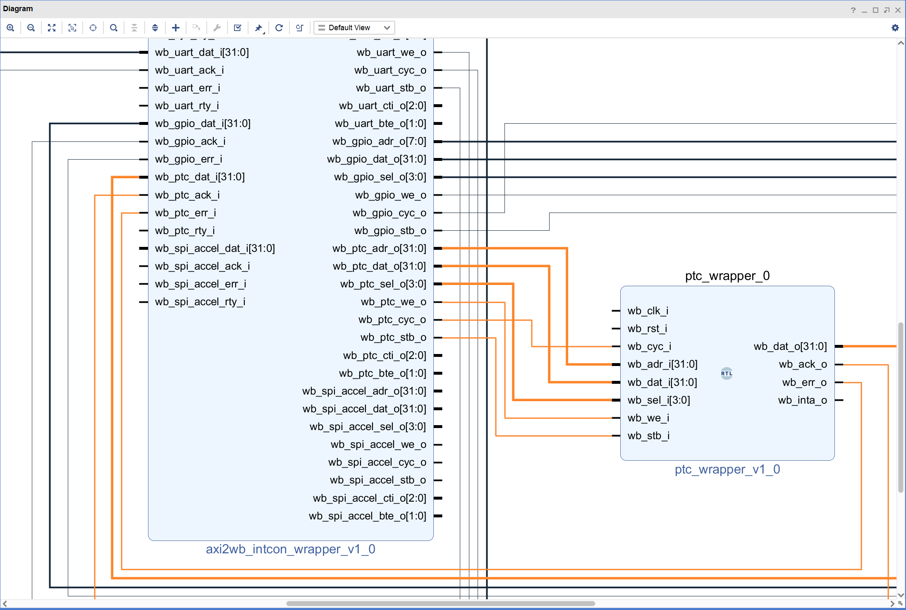
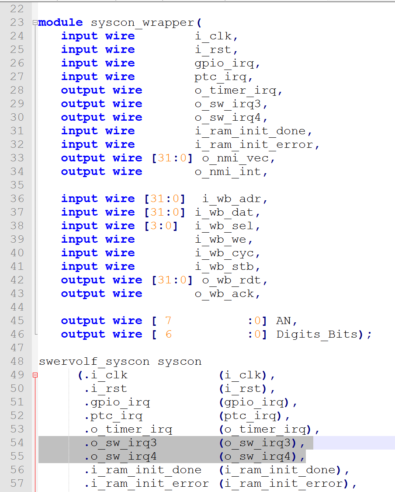
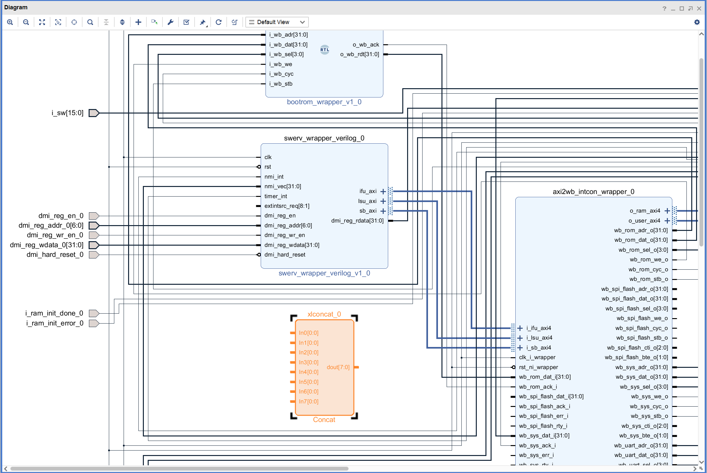
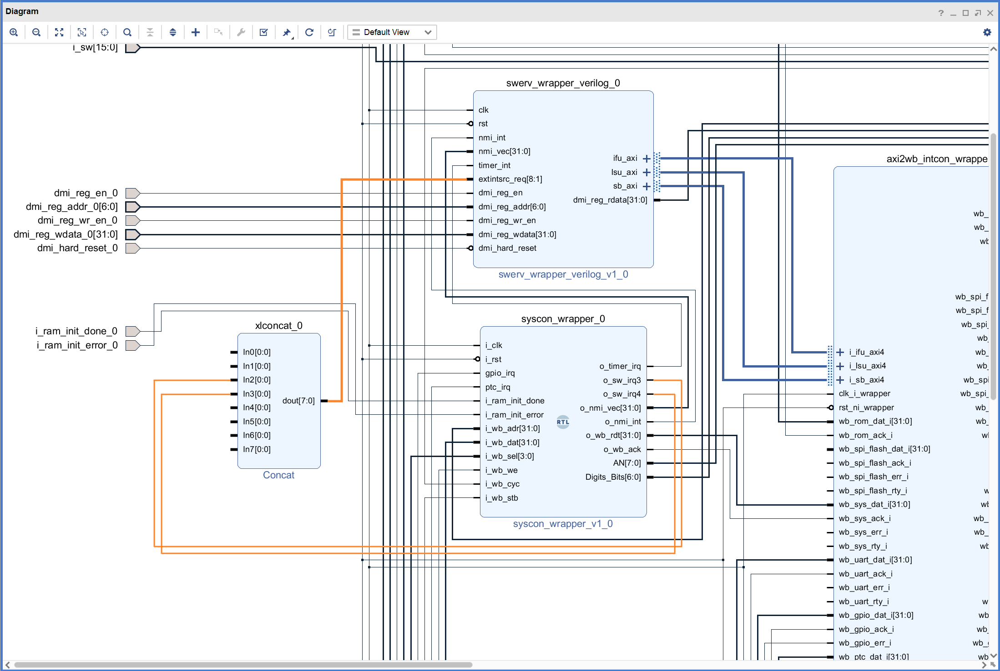

# 定时器实验

## 1. 概述

硬件定时器是单片机和SoC中常见的外设，通常用于生成精确时序。定时器以固定频率（该频率通常是可配置的）递增或递减计数器，
然后在计数器达到零或预定义值时中断处理器。更复杂的定时器还可以执行其他功能，
例如生成脉宽调制（Pulse-Width Modulated，PWM）波形以控制电机转速或灯光亮度。

RVfpga_SoC所使用的定时器模块是从OpenCores获取的，下载链接为：https://opencores.org/projects/ptc。

定时器模块的主要特性如下（有关完整的信息，请参见上述文档）：

- 使用Wishbone互连
- 32位计数器/定时器模块
- 单次运行或连续运行PWM/定时器/计数器（PWM/Timer/Counter，PTC）
- 可编程PWM（脉宽调制）模式
- 系统时钟和外部时钟源，用于定时器功能
- 高电平/低电平参考和捕捉寄存器
- PWM输出驱动器的三态控制
- PTC功能可向CPU发出中断

RVfpga_SoC中定时器的基址为0x80001200，定时器模块内部可用的控制和状态寄存器如下表所示。

表中，RPTC_CNTR寄存器是实际的计数器寄存器，每个计数器/定时器时钟周期递增一次。RPTC_CTRL寄存器用于控制定时器模块（下表显示了其中每个位的功能）。RPTC_HRC和RPTC_LRC用作参考/捕捉寄存器。

定时器可以在不同的模式下运行：

-  **定时器/计数器模式：** 在此模式下，如果使能了计数器（RPTC_CTRL[EN] = 1），则系统时钟或外部时钟参考会递增寄存器RPTC_CNTR。当RPTC_CNTR等于RPTC_LRC时，如果RPTC_CTRL[INTE]置1，则RPTC_CTRL[INT]变为高电平。
-  **PWM模式：** 脉宽调制（PWM）信号是一种使用数字源生成模拟信号的方法。PWM信号由两个定义其行为的值组成：占空比和频率。占空比描述信号为高电平的时间占完成一个周期所用总时间的百分比。频率是周期重复的频率。为器件供电后，如果以足够快的速率和一定的占空比循环开关数字信号，输出会表现为恒压模拟信号。例如，占空比为50%（一半的周期时间为高电平）的3.3V高压信号相当于1.67V（整个周期的平均电压）的模拟负载。相同的信号，占空比为33%时则相当于1.1V。要在PWM模式下运行，RPTC_CTRL[OE]应置1。寄存器RPTC_HRC和RPTC_LRC应分别设为PWM输出信号的高电平周期和低电平周期的值：（RPTC_CNTR）复位后，PWM信号应变为高电平RPTC_HRC时钟周期；（RPTC_CNTR）复位后，PWM信号应变为低电平RPTC_LRC时钟周期。

## 2. 在RVfpgaSoC系统中添加定时器硬件模块
启动Vivado，打开实验5的工程。在“Project Manager”（项目管理）中选择“Add Sources”（添加源文件），在“Add Sources”（添加源文件）窗口中，单击“Add Directories”（添加目录），将ptc目录添加到工程，如下图所示。

点击“Open Block Design”打开块设计，如下图所示，通过“Add Module”将ptc_wrapper模块添加到块设计。

将刚刚添加的ptc_wrapper_0模块连接到块设计，连接完成后如下图所示。

然后，连接ptc_wrapper_0模块的时钟和复位引脚。

接着，将ptc_wrapper_0模块的“wb_inta_o”引脚连接syscon_wrapper_0模块的“ptc_irq”引脚。

修改rtl_src/SystemController目录下的syscon_wrapper.v文件，将29和30行的注释取消，同时连接到54和55行，如下图所示。

通过“Add IP”添加一个concat模块，如下图所示。

将syscon_wrapper_0模块的“o_sw_irq3”和“o_sw_irq4”引脚分别连接到刚添加的concat模块的“In2”和“In3”引脚，同时concat模块的“dout”引脚连接到swerv_wrapper_verilog_0模块的“extintsrc_req引脚”，如下图所示。

点击Validate Design，对设计的正确性进行校验。校验过程中如果出现警告，点击OK忽略。

点击Generate Bitstream按键，生成bitstream文件。

### 3. 应用程序编译、调试和执行
参照前面的实验，创建RVfpga工程，编写一个程序，在8位7段显示屏上显示升序计数。
该值应大约每秒钟改变一次，一秒延时将使用定时器模块来生成。

### 4. 动手实验
修改ptc目录下的ptc_wrapper.v文件，将pwm_pad_o信号输出；然后，修改块设计，将该“pwm_pad_o”引脚连接到Nexys4 DDR开发板上的两个三色LED之一（注：实验5的PWM模块已经占用了两个三色LED的各一色，还有4色可以选择）。

编写应用程序，通过硬件定时器来调整LED的占空比。
