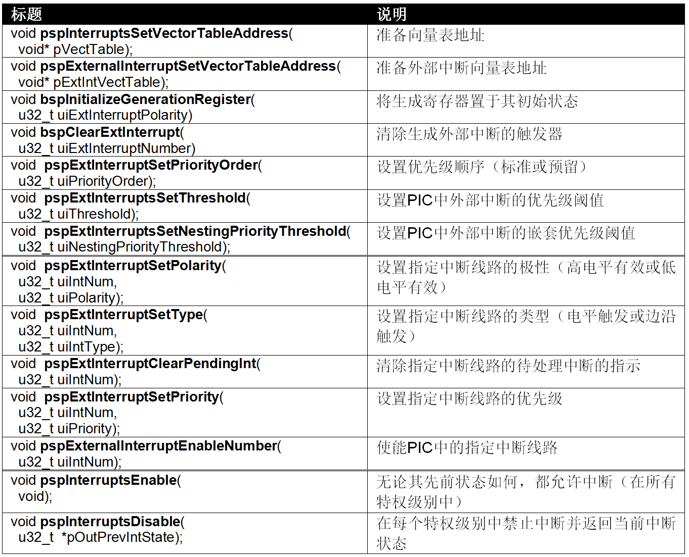
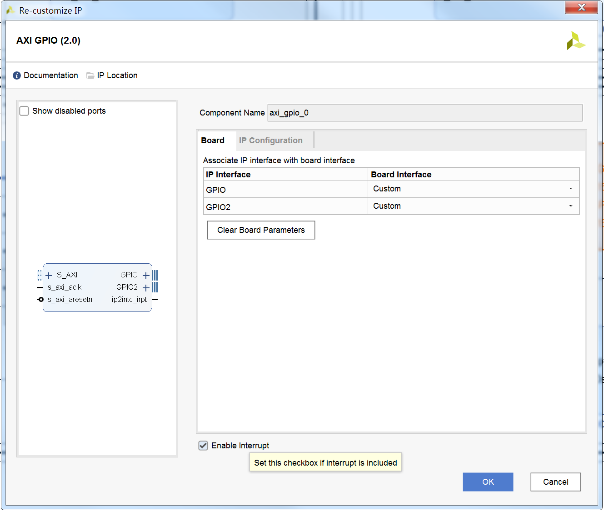
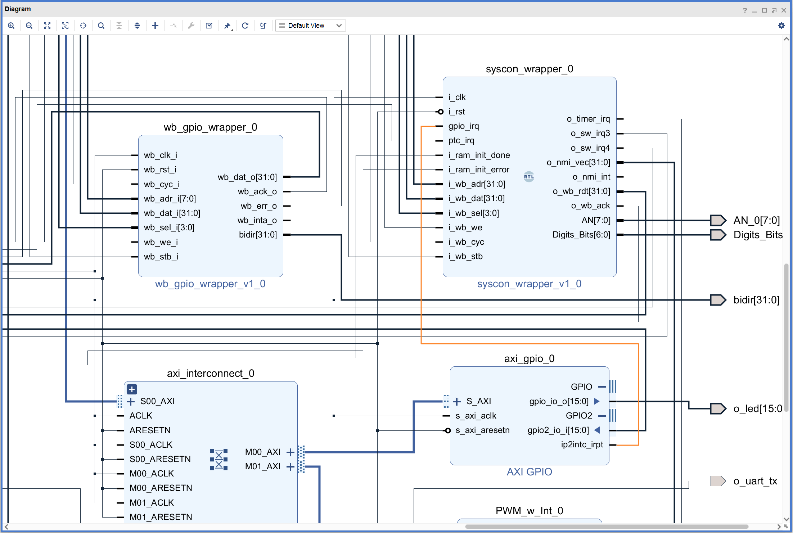
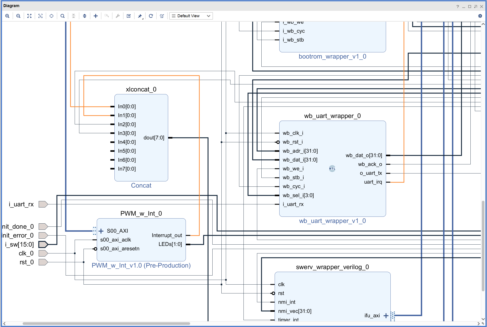
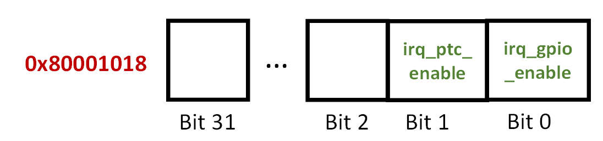
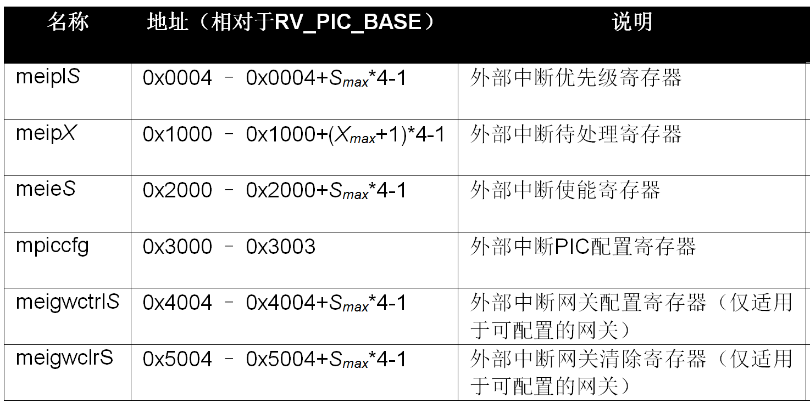
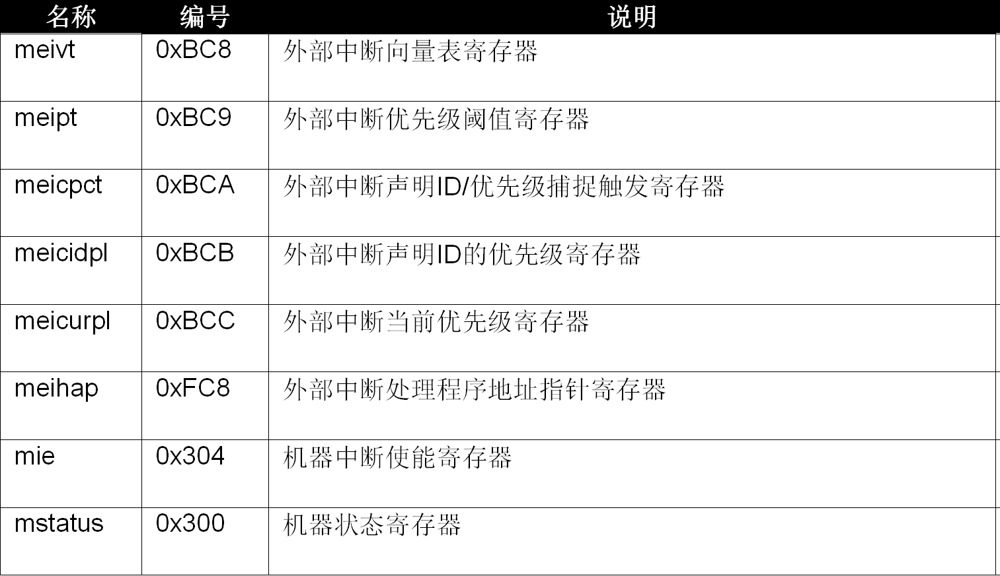

# 中断实验

## 1. 概述
在本实验中，我们介绍如何在RVfpga_SoC上使用中断。中断可能由软件或硬件生成。

在本实验中，我们重点介绍由物理引脚值变化而触发的硬件中断。具体来说，我们将学习说明RVfpga_SoC的中断控制器的操作（该控制器是SweRV EH1内核的一部分）。
我们将如何使用Western Digital的外设支持包（Peripherals Support Package，PSP）和电路板支持包（Board Support Package，BSP）来配置外部中断，
PSP和BSP是包含硬件外设驱动程序的软件。

### 1.1 中断I/O方式
通常RVfpga_SoC可通过以下几种方法与外设交互：程序查询方式、中断方式或直接存储器访问（Direct Memory Access，DMA）方式。
在前面的实验中，我们都是使用的程序查询方式与外设交互。使用程序查询I/O时，用户程序会连续轮询I/O接口，并根据其状态相应地做出响应。
程序查询I/O很容易实现，并且只需要很少的硬件支持，但是对I/O接口的连续轮询会使处理器忙于处理无用的工作。 

中断方式I/O可避免此问题，使程序仅在外设上发生事件时才做出响应。此时，外设负责在某些事件发生时向处理器发送信号（称为中断），
例如定时器溢出、在UART接口上接收到字符、按钮切换等事件。当没有事件发生（即没有中断）时，处理器继续执行有用的工作。
当处理器接收到中断时，它将停止正在运行的程序，并调用中断服务程序（Interrupt Service Routine，ISR），也称作中断处理程序。
ISR本质上是一个包含void参数的函数，可用于处理中断（即读取按钮的新值、执行一些与定时器溢出相关的操作等）。处理器通常支持非向量中断模式或向量模式。
在非向量中断模式下，所有中断都调用相同的ISR；因此，当发生中断时，处理器将暂停主程序并跳转到通用ISR，后者首先确定中断源，
然后执行与所确定的中断原因相对应的特定ISR代码。在向量中断模式下，每个中断都会调用不同的ISR。
因此，当发生中断时，会首先确定中断原因，然后程序跳转到与所确定的原因相对应的ISR。

处理器通常允许对中断进行优先处理。不仅将优先处理较高优先级的中断，而且较高优先级的中断将抢占正在处理的较低优先级的中断。
例如，假设将按钮中断优先级设置为5，将定时器中断优先级设置为7，并将阈值设置为4（因此两个优先级都高于阈值）。
如果程序正在执行其正常流程，此时按下了按钮，则将发生中断，并且处理器调用ISR，ISR将从按钮读取数据并加以处理。
如果在按钮ISR激活时定时器溢出，则ISR本身将被中断，以便处理器可以立即处理定时器溢出。处理完成后，它将返回以完成按钮中断，然后返回主程序。

### 1.2 SWERV EH1提供的可编程中断控制器
SweRV EH1内核（参见[《RISC-V SweRV EH1编程器参考手册》](https://github.com/chipsalliance/Cores-SweRV/blob/master/docs/RISC-V_SweRV_EH1_PRM.pdf)第6章）的外部中断在很大程度上是按照RISC-V PLIC（平台级中断控制器）规范（参见[《RISC-V指令集手册 - 第II卷：特权架构》](https://github.com/riscv/riscv-isa-manual/releases/tag/draft-20181201-2650e2a)第7章）建模的。但是，中断控制器与内核而不是平台相关联。因此，更通用的术语是PIC（可编程中断控制器），用于指代SweRV EH1内核中可用的控制器。

PIC提供以下主要特性：

- 支持多达255个外部中断源（从1（最高优先级）到255（最低优先级））；每个中断源都有其自己的允许位。
- 除源编号外，还额外提供15个优先级；有两种优先方案可用：1-15（其中1是最低优先级）或0-14（其中14是最低优先级）。可以为每个源分配一个优先级。
- 提供对可编程优先级阈值的支持，以禁用较低优先级的中断。
- 支持向量外部中断、中断链和嵌套中断。

所有生成中断的功能单元都称为外部中断源。外部中断源通过向PIC发送异步信号来指示中断请求。每个外部中断源都连接到专用网关（位于PIC内部），该专用网关是一种硬件结构，负责将中断请求与内核的时钟域同步，并将请求信号转换为PIC的通用中断请求格式（即，高电平/低电平有效或电平触发）。PIC一次只能为每个中断源处理一个中断请求。它会评估所有待处理的和允许的中断请求，并选择具有最低源ID的优先级最高的中断。然后，将此优先级与可编程的优先级阈值进行比较，并且为了支持嵌套中断，还会与中断处理程序（如果当前正在运行）
的优先级进行比较。如果所选请求的优先级高于这两个阈值，则PIC将向内核发送中断通知，内核会停止主程序的执行并跳转到相应的ISR。

PIC的主要功能概括为以下几个基本步骤：

-  **允许/禁止：** PIC能够允许/禁止外部中断
-  **配置：** 可以将PIC配置为监听具有不同极性（高电平有效/低电平有效）或类型（边沿触发/电平触发）的外部中断。PIC还允许将ISR分配给不同的存储器地址。
-  **过滤和优先级分配：** PIC允许为中断分配优先级。当主程序运行时，PIC选择已允许的优先级最高的触发中断。
-  **通知：** PIC选择了优先级最高的中断后，它将通知内核停止执行主程序，以便跳转到为所选中断服务的程序。
-  **抢占：** 如果允许嵌套中断，则可以抢占由另一个具有更高优先级的中断服务的中断。

### 1.3 在SweRV EH1中配置外部中断
与任何其他外设类似，PIC使用存储器映射寄存器进行配置，用户可通过装载/存储指令访问这些寄存器。可以在寄存器级别使用中断系统，但该过程非常复杂；幸运的是，WD的处理器支持包（Processor Support Package，PSP）和电路板支持包（BSP）包括多个函数，这些函数提供了一种更简单的方法来使用中断实现程序。

下表所示为配置外部中断所需的主要函数和宏。

中断系统的默认初始化过程：

- 在中断向量模式下，设置外部向量中断地址表的基址。使用函数pspInterruptsSetVectorTableAddress和pspExternalInterruptSetVectorTableAddress。
- 将生成寄存器置于其初始状态。使用函数bspInitializeGenerationRegister。
- 确保清除了外部中断触发器。使用函数bspClearExtInterrupt。
- 设置优先级顺序（函数pspExtInterruptSetPriorityOrder）、阈值（函数pspExtInterruptsSetThreshold）和嵌套优先级阈值（函数pspExtInterruptsSetNestingPriorityThreshold）的默认值。

每个中断源的初始化过程：

- 对于每个中断源，使用函数pspExtInterruptSetPolarity和pspExtInterruptSetType设置极性（高电平有效/低电平有效）和类型（电平触发/边沿触发）
- 使用函数pspExtInterruptClearPendingInt清除所有待处理的中断。
- 使用函数pspExtInterruptSetPriority设置每个外部中断源的优先级。
- 使用函数pspExternalInterruptEnableNumber为适当的外部中断源允许中断。
- 在多向量模式下，对于每个外部中断源，将相应处理程序的地址写入外部向量中断地址表中。

## 2. RVfpga_SoC外部中断实验
### 2.1 修改RVfpga_SoC硬件
启动Vivado，打开实验6的工程。点击“Open Block Design”打开块设计。

在块设计中双击axi_gpio_0模块，如下图所示，勾选“Enable Interrupt”。

删除wb_gpio_wrapper_0模块“wb_inta_o”引脚与syscon_wrapper_0模块“gpio_irq”引脚的连线，然后将axi_gpio_0模块的“ip2intc_irpt”引脚连接到syscon_wrapper_0模块“gpio_irq”引脚，如下图所示。

接着，将wb_uart_wrapper_0模块的“uart_irq”引脚和PWM_w_Int_0模块的“Interrupt_out”引脚分别连接到xlconcat_0模块的“In0”和“In1”引脚，如下图所示。（这一步是为后面的 **动手实验** 做准备！）

点击Validate Design，对设计的正确性进行校验。校验过程中如果出现警告，点击OK忽略。

点击Generate Bitstream按键，生成bitstream文件。

### 2.2 应用程序编译、调试和执行
参照前面的实验，创建RVfpga工程，编写一个程序，程序将使用中断I/O方式来读取最右侧开关的状态。

main函数执行以下任务：

-  **初始化中断系统：** 中断的默认初始化调用函数DefaultInitialization，通过调用函数pspExtInterruptsSetThreshold(5)设置特定的阈值。优先级不超过此阈值的外部中断将被忽略。
-  **初始化外部中断线路IRQ4：** 调用函数ExternalIntLine_Initialization初始化线路IRQ4，用于中断线路4，优先级为6，GPIO_ISR作为中断服务程序。之所以要初始化IRQ4并将IRQ4与GPIO服务程序关联，是因为RVfpga_SoC硬件中GPIO的中断请求连接在RVfpga_SoC处理器PIC的IRQ4引脚上。具体方法是设置字0x80001018的位0（在程序中标记为Select_INT）。该系统控制器存储器映射寄存器包含2位（如下图所示），位0，称为irq_gpio_enable，设置为1时用于将GPIO中断线路与IRQ4连接；位1，称为irq_ptc_enable，设置为1时用于将定时器中断线路与IRQ3连接。

-  **初始化外设（在本例中，为GPIO和7段数码管）：** 调用函数GPIO_Initialization并使能八个7段数码管理。
-  **允许中断：** 调用函数pspInterruptsEnable和宏M_PSP_SET_CSR。常量D_PSP_MIE_NUM和D_PSP_MIE_MEIE_MASK由WD的PSP定义。

## 3. 动手实验
对实验5的PWM演示程序进行修改，要求通过采用中断方式进行UART的输入，并且当PWM模块的输入值超过阈值时（阈值范围为0-9），通过中断服务程序将PWM的输入值重置为0。

## 附录：SweRV EH1内核的可编程中断控制器
本附录介绍SweRV EH1内核的可编程中断控制器（Programmable Interrupt Controller，PIC）如何在寄存器级管理外部中断。PIC使用下表所示的存储器映射寄存器。必须注意的是，PIC存储器空间的起始地址为0xF00C0000；此地址称为RV_PIC_BASE。地址是相对于该基址给出的。

所有寄存器均为32位宽，并且可通过装载和存储指令访问，与存储器映射I/O一样。访问类型取决于我们要访问的特定位。

一些寄存器具有以S或X结尾的参数化名称。这些寄存器可能存在多个实例。参数S是指外部中断源的数量，在SweRV EH1中等于网关的数量。因此，以“S”结尾的寄存器具有1到255个可用的寄存器实例。在本实验中，我们仅使用2个外部中断源：IRQ3（与定时器相关）和IRQ4（与GPIO相关）。参数X是指一组32个网关。这并不意味着对网关进行了分组，但是对其进行分组可以减少某些32位寄存器所需的存储器大小，其中1个位便足以对一组外部中断源执行操作。外部中断待处理寄存器就是这种情况，其中1个位便足以区分是否已处理该中断。

除了上表中所示的寄存器外，PIC还包含控制和状态寄存器（CSR）。标准RISC-V ISA建立了12位编码空间（csr[11:0]），最多支持4,096个CSR。按照惯例，CSR地址的高4位（csr[11:8]）用于根据特权级别对CSR的读写可访问性进行编码。前两位（csr[11:10]）指示寄存器是读/写（00、01或10）还是只读（11）。后两位（CSR[9：8]）对可以访问CSR的最低特权级别进行编码。有关CSR的更多信息，请参见上面列出的文档。

下表列出了有助于管理SwerRV EH1内核中的外部中断的CSR。可通过csrrw或csrrs（CSR读/写和CSR读/设置）等专用装载和存储指令访问这些CSR。

### A. 外部中断配置
下面是使用上述寄存器配置外部中断所需的基本步骤：

1） 通过将mie CSR中的位miep清零，禁止所有外部中断。

2） 通过写入mpiccfg寄存器的priord位来配置优先级顺序。

3） 在多向量模式下，如果未配置，则通过写入meivt寄存器的基址字段来设置外部向量中断地址表的基址。

4） 通过写入meipt寄存器的prithresh字段来设置优先级阈值。

5） 通过向meicidpl寄存器的clidpri字段和meicurpl寄存器的currpri字段写入“0”（或对于反转的优先级顺序写入“15”）来初始化嵌套优先级阈值。

6） 对于每个可配置的网关S，在meigwctrlS寄存器中设置极性（高电平有效/低电平有效）和类型（电平触发/边沿触发），并通过写入网关的meigwclrS寄存器将IP位清零。

7） 在多向量模式下，对于每个外部中断源S，将相应处理程序的地址写入外部向量中断地址表中。

8） 通过写入meiplS寄存器的相应优先级字段，设置每个外部中断源S的优先级。

9） 通过设置每个中断源S的meieS寄存器的inten位，为适当的外部中断源允许中断。

10） 激活mstatus CSR中的mei位。

11） 通过设置mie CSR中的位miep，允许所有外部中断。

以上是用于S网关的常规步骤。但是，在RVfpga_SoC中，我们仅使用2个中断源（IRQ3和IRQ4），每个中断源都有其自己的网关。
而且，需要注意的是，不必非要遵循上述顺序，因为一些操作是可以互换的（例如，可以在步骤2之前完成步骤4）。
此外，由于每个函数在输入时都会调用pspInterruptsDisable，因此不一定要执行步骤1。

### B. 外部中断工作模式
一旦在外部中断线路（导线）上发生所需事件，就会执行以下操作：

1）PIC决定哪个待处理中断具有最高优先级。

2）当目标hart（硬件线程）采用外部中断时，它会禁止所有中断（即将RISC-V hart的mstatus寄存器中的mie位清零），并跳转到外部中断处理程序。

3）外部中断处理程序写入meicpct寄存器，以触发对待处理的最高优先级外部中断的中断源ID（在meihap寄存器中）及其相应优先级（在meicidpl寄存器中）的捕捉操作。

4）然后，处理程序读取meihap寄存器以获取在claimid字段中提供的中断源ID。根据meihap寄存器的内容，外部中断处理程序跳转到特定于该外部中断源的处理程序。

5）特定于源的中断处理程序（ISR）处理外部中断，随后：

    I）对于电平触发的中断源，中断处理程序会清除SoC IP中发起中断请求的状态。

    II）对于边沿触发的中断源，中断处理程序通过写入meigwclrS寄存器将源网关中的IP位清零。这会将源的中断请求置为无效。

6）同时，PIC在后台继续评估待处理的中断。

必须注意的是，这是一种常规的工作模式。此外，SweRV EH1内核还支持嵌套中断（最多15个）。
