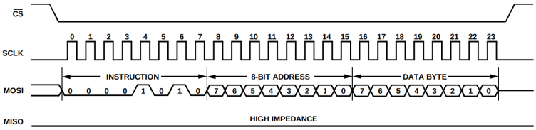

# 模拟量接口实验

## 1. 概述
本实验将练习如何使用Nexys4 DDR开发板上的ADXL362加速计和ADT7420温度传感器，从而掌握模块量接口技术。

### 1.1 ADXL362加速计规范
Nexys4 DDR开发板包括一个模拟器件ADXL362加速计。有关该器件的完整信息，请参看[ADXL362数据手册](https://www.analog.com/media/en/technical-documentation/data-sheets/ADXL362.pdf)。

ADXL362是一款3轴MEMS加速计，在100Hz输出数据速率下的功耗不到2μA，在运动触发唤醒模式下的功耗为270nA。
该加速计拥有12位输出分辨率，但同时也提供8位格式化数据，以便在低分辨率即可满足要求时采用更高效的单字节传输。
测量范围为±2g、±4g和±8g，其中±2g范围内的分辨率为1mg/LSB。当ADXL362处于测量模式时，将连续测量加速度数据并将其存储在X数据、Y数据和Z数据寄存器中。

ADXL362加速计包括多个寄存器（如下表所示），用户可以使用这些寄存器对其进行配置以及读取加速度数据。
写入控制寄存器可以配置加速计，读取器件寄存器可以获取加速计数据。与该器件通信时，必须指定一个寄存器地址以及一个用于指示通信是读操作还是写操作的标志。
当寄存器地址与通信标志发送到器件后，即可开始传输数据。

该加速计是采用SPI通信方案的外设。推荐的SPI时钟频率范围为1-5MHz。SPI以SPI模式0（CPOL=0、且CPHA=0）工作。SPI端口采用多字节结构，其中第一个字节指示通信是执行寄存器读操作（0x0B）还是寄存器写操作（0x0A）。SPI数据格式如下图所示。

下图两张图举例说明了SPI控制器（控制器）与加速计（外设）之间的通信，图一给出了寄存器读操作，图二给出了寄存器写操作。

### 1.2 ADT7420温度传感器
Nexys4 DDR开发板还包括一个模拟器件ADT7420温度传感器。有关该器件的完整信息，请参看[ADT7420数据手册](https://www.analog.com/media/en/technical-documentation/data-sheets/ADT7420.pdf)。

ADT7420是一款4mm×4mm LFCSP封装高精度数字温度传感器，可在较宽的工业温度范围内提供突破性的性能。它内置一个带隙温度基准源、一个温度传感器和一个16位ADC，用来监控温度并进行数字转换，分辨率为0.0078℃。默认ADC分辨率设置为13位(0.0625℃)。ADC分辨率为用
户可编程模式，可通过串行接口更改。

ADT7420的引脚A0和A1用于地址选择，可为ADT7420提供四个I2C地址。CT引脚属于开漏输出，当温度超过临界温度限值(可编程)时，该引脚变为有效。INT引脚也属于开漏输出，当温度超过限值(可编程)时，该引脚变为有效。INT引脚和CT引脚可在比较器模式和中断事件模式下工作。

ADT7420内置14个寄存器（如下图所示）：

- 9个温度寄存器
- 1个状态寄存器
- 1个ID寄存器
- 1个配置寄存器
- 1个地址指针寄存器
- 1个软件复位

该温度传感器是采用I2C通信方案的外设。其写入一个寄存器、后跟单字节数据的I2C格式如下图所示。

写入一个寄存器、后跟两字节数据的I2C格式如下图所示。

 从配置寄存器读回数据的I2C格式如下图所示。

 从温度值寄存器读回数据的I2C格式如下图所示。

## 2. RVfpga_SoC模拟量接口实验
### 2.1 修改RVfpga_SoC硬件
启动Vivado，打开实验7的工程。在“Project Manager”（项目管理）中选择“Add Sources”（添加源文件），在“Add Sources”（添加源文件）窗口中，单击“Add Directories”（添加目录），将spi目录添加到工程，如下图所示。

点击“Open Block Design”打开块设计，如下图所示，通过“Add Module”将wb_spi_wrapper模块添加到块设计。

点击“Add IP”添加一个AXI IIC模块，添加后的块设计如下图所示。

将wb_spi_warpper_0模块连接到块设计，如下图所示。

双击axi_interconnect_0模块，在互连模块上增加一个AXI的主端口，然后将axi_iic_0模块连接到新增加的AXI4端口，如下图所示。

连接wb_spi_warpper_0模块和axi_iic_0模块的时钟和复位信号。

将wb_spi_warpper_0模块的“o_accel_sclk”、“o_accel_cs_n”、“o_accel_mosi”和“i_accel_miso”引脚设置为外部引脚。再将axi_iic_0模块的IIC端口设置为外部引脚，并更名为“temp_sensor”，如下图所示。

将wb_spi_warpper_0模块的“spi_irq”和axi_iic_0模块的“iic2intc_irpt”引脚分别连接到xlconcat_0模块的“In4”和“In5”引脚，如下图所示。

打开“Address Editor”，将axi_iic_0模块的地址设置为0x80130000，如下图所示。

点击Validate Design，对设计的正确性进行校验。校验过程中如果出现警告，点击OK忽略。

点击Generate Block Design，弹出对话框后选择Generate更新swerv_soc_wrapper文件。

根据更新后的swerv_soc_wrapper对rvfpga.sv文件进行修改，如下图所示，添加2个输入输出端口，同时增加swerv_soc_wrapper模块的端口引用。

再根据修改后的rvfpga.sv文件对rvfpga.xdc约束文件进行修改，如下图所示，增加对温度传感器引脚的约束。

最后，点击Generate Bitstream按键，生成bitstream文件。

### 2.2 ADXL362加速计应用
创建RVfpga工程，编写程序，读取ADT7420温度传感器测量的环境温度，并通过UART传送到主机显示。

## 3. 动手实验
创建RVfpga工程，编写程序，读取X轴、Y轴和Z轴加速度数据的高8位，然后在8位7段显示屏上显示这些值。

